# Decision Card

> **Read this first. Stop here unless you need the receipts.**

**Goal.** Extend `scripts/kc-baker-pipeline-v2` so the cascade can ingest a single video URL or a YouTube playlist (today: pre-extracted text only), produce word-timestamped transcripts, run them through the existing Pass-1→Commit cascade, and use the transcripts' timestamps to **cut**, **splice**, and **stitch** the source video into derived clips driven by the Silmari graph (e.g. *"render every moment underwriting hub `recurring-power`"*).

**The single most important fact for implementation:** there is **already a working transcriber** at `~/Dev/bulk_transcribe_youtube_videos_from_playlist/bulk_transcribe_youtube_videos_from_playlist.py`. It produced today's `tests/fixtures/kc_bakers_words_of_wisdom.txt` and the `downloaded_audio/*.mp4` corpus. The recommendation below is to **wrap and extend** it, not replace it. See §0 immediately below for the integration story.

**Recommended stack (v1):**

| Layer | Tool | Why |
|---|---|---|
| **Acquire** | **Existing `bulk_transcribe_youtube_videos_from_playlist.py`** (uses `pytubefix`) — keep as-is, no swap to yt-dlp unless pytubefix breaks | Already in production for this corpus; pytubefix has its own download path that is not subject to the same PO-Token failure mode as yt-dlp. Do NOT swap unless pytubefix actually fails — fall back to yt-dlp + `bgutil-ytdlp-pot-provider` plugin only on confirmed breakage. |
| **Transcribe** | **Extend the existing transcriber** with three small additions: (1) `word_timestamps=True` flag on `model.transcribe(...)`, (2) flip `disable_cuda_override = 0` to enable GPU, (3) bolt on a WhisperX alignment + Silero VAD snap pass on the segment output | The existing script already runs `faster_whisper("large-v3", beam_size=10, vad_filter=True)` — the engine choice was already correct. The missing piece is per-WORD start/end (currently only per-segment). Add the flag, add the post-process, you have boundary precision F1≈0.79 @ 50ms. CrisperWhisper weight swap is an optional later improvement, not a v1 requirement. |
| **Bridge** | New `transcripts/<video_id>.words.json` sidecar; cards carry **labels** (`ref:ev:video=X:t=A-B`) per beads_rust precedent — **no Silmari Store schema change** | `BiblioInput.source` is `string` today (probed). Label-encoding is the established pattern for non-whitelisted edges (per `MEMORY.md` `project_beads_rust_dep_whitelist.md`). |
| **Edit** | **Bun/TypeScript orchestrating ffmpeg directly**, with **OpenTimelineIO (OTIO)** as EDL emitter via the existing Python venv | Cuts are *computed from card spans*, not from silence — so silence-cut tools (auto-editor default) are the wrong abstraction. Direct ffmpeg is the only consumer-of-arbitrary-spans path that emits both rendered video and an editor-importable EDL. |
| **Stitch** | ffmpeg `concat` filter (re-encode) **after** per-clip normalization to a fixed profile (1920×1080 yuv420p H.264 @ 30fps + 48kHz stereo AAC) | The `concat` *demuxer* fails silently on codec mismatch; the *filter* re-encodes through normalization. Re-encoding for cut precision (Q2) gives concat normalization (Q3) for free. |

**Fallbacks (documented, not default):**
- Transcribe → **Deepgram Nova-3 batch** ($0.0043/min, native diarization, on-prem option preserves no-lock-in posture).
- Edit → **auto-editor v3 JSON timeline** (`--edit none --export timeline:api=3`) when ffmpeg filter graphs get gnarly.

**Pipeline shape — mermaid (ISC-47):**

```mermaid
flowchart TD
    A["yt-dlp<br/>(+ PO-Token plugin)"] -->|".mp4 + .info.json + .vtt"| B["ffmpeg<br/>extract audio (.wav)"]
    B --> C["faster-whisper<br/>+ CrisperWhisper weights"]
    C --> D["WhisperX<br/>wav2vec2 alignment"]
    D --> E["Silero VAD<br/>boundary snap"]
    E -->|"transcripts/&lt;id&gt;.words.json"| F["plain-text adapter"]
    F -->|"transcripts/&lt;id&gt;.txt"| G["Pass 1 themes"]
    G --> H["Pass 2 ideas"]
    H --> I["Pass 3 micros"]
    I --> J["Gate A atomicity"]
    J --> K["Fix flagged"]
    K --> L["Ingest cards<br/>+ Tier-A edges"]
    L -->|"NEW"| M["Bridge:<br/>segments.json + ref:ev: labels"]
    M --> N["Gate B + Commit<br/>(typed edges)"]
    N -->|"on demand"| O["zk_recall &#124; hub &#124; folgezettel<br/>→ spans[]"]
    O --> P["spansToCutPlan.ts"]
    P -->|"(a) ffmpeg concat-filter"| Q["rendered .mp4"]
    P -->|"(b) OTIO → CMX 3600"| R[".edl handoff"]

    style A fill:#fde,stroke:#333
    style M fill:#fde,stroke:#333
    style P fill:#fde,stroke:#333
    style Q fill:#dfd,stroke:#333
    style R fill:#dfd,stroke:#333
```



(Pink = new, green = output. Pass 1 → Commit unchanged from v2.)

**Pipeline shape — ASCII alternate:**

```
yt-dlp ──► .mp4 + .info.json + .vtt(auto-cap)
                │
                ▼
faster-whisper-CrisperWhisper ──► raw transcript
                │
                ▼
WhisperX wav2vec2 alignment + Silero VAD snap ──► transcripts/<id>.words.json
                │                                   (word-level, ±50ms)
                ▼
[existing cascade] Pass1→Pass2→Pass3→Gate A→Fix→Ingest→Gate B→Commit
                │
                ▼
Cards (with `ref:ev:video=X:t=A-B` labels back to source spans)
                │
                ▼ (on demand, MCP-triggered)
zk_recall|hub|folgezettel ──► spans[] ──► spansToCutPlan.ts ──► (a) ffmpeg concat-filter render + (b) .otio EDL
```

**Non-negotiable invariants:**

1. **No embeddings anywhere.** Link structure IS retrieval (Silmari framework invariant; see `MEMORY.md` `feedback_zettelkasten_no_embeddings.md`).
2. **No greenfield rewrite of v2.** Acquire and Edit are *new layers around* the existing cascade. `CASCADE_ACQUIRE_MODE=file` (today's behavior) must keep working unchanged.
3. **Always re-encode on cut.** YouTube downloads have GOP density 5–10 s; `-c copy` produces cuts that are off by *seconds*. Re-encode every clip (`-ss` after `-i`, `libx264 -crf 18 -preset medium -c:a aac -ar 48000`) and accept the CPU cost.
4. **Local-first, never SaaS-only.** Every recommended layer has a documented local-only path.

**One-page open-question list (8 items)** at the bottom — these are decisions only the user can make. Read them before implementation.

---

## 0 — Existing infrastructure to wrap (start here)

### 0.1 What's already running

Located at `~/Dev/bulk_transcribe_youtube_videos_from_playlist/`:

| Artifact | What it is | Status |
|---|---|---|
| `bulk_transcribe_youtube_videos_from_playlist.py` | One-file Python async pipeline: pytubefix download → faster_whisper transcribe → SpaCy sentence-split → write txt + csv + json | **Working — produced today's KC Baker corpus** |
| `downloaded_audio/<slug>.mp4` | The KC Baker source mp4s (15 files, all "voice/power/speaking" talks) | Present; persistent on disk |
| `generated_transcript_combined_texts/<slug>.txt` | Plain-text transcripts (the same shape `kc-baker-pipeline-v2/tests/fixtures/kc_bakers_words_of_wisdom.txt` carries) | Present |
| `generated_transcript_metadata_tables/<slug>.{csv,json}` | Per-segment metadata: `start`, `end`, `text`, `avg_logprob` — **segment-level only, no word-level timestamps yet** | Present |
| `transcript_reader.html` | Standalone reader/viewer (out of scope for this pipeline) | Present |

### 0.2 The exact diff that takes today's transcriber from "transcript producer" to "cut/splice/stitch enabler"

```diff
- segments, info = await asyncio.to_thread(model.transcribe, audio_file_path, beam_size=10, vad_filter=True)
+ segments, info = await asyncio.to_thread(model.transcribe, audio_file_path, beam_size=10, vad_filter=True, word_timestamps=True)
```

That single flag turns each segment's `words: [{word, start, end, probability}, …]` from `None` into a populated list. Total code change: **one keyword argument**. The downstream JSON writer needs ~5 extra lines to walk `segment.words` and serialize them.

### 0.3 The two improvements that aren't strictly required but will pay off

1. **Enable GPU.** Today: `disable_cuda_override = 1` (line 27) forces CPU. The user's machine has NVIDIA driver 550.163.01 + CUDA 12.4 (confirmed). Flip to `0`. Expected speedup: 30–100× (CPU 90-min talk takes ~30+ min; GPU takes ~2–5 min). One-line change.

2. **Bolt on WhisperX alignment + Silero VAD snap.** Today's faster-whisper word-timestamps inherit vanilla Whisper's drift (F1≈0.66 AMI @ 50ms). Adding WhisperX wav2vec2 forced alignment + Silero VAD snap raises this to F1≈0.79 @ 50ms — the difference between "cuts land mid-syllable 30% of the time" and "cuts land cleanly ~80% of the time." This is a new dependency (`pip install whisperx silero-vad`) and a ~30-line post-process function. Defer to Beta if MVP doesn't need the precision floor; ship in MVP if cut quality is the demo.

### 0.4 Security finding — flag before any other work

Line 25 of `bulk_transcribe_youtube_videos_from_playlist.py` contains a **hardcoded OpenAI API key in source**: `openai_api_key = 'sk-proj-…'`. Before this script ships into a repo / docker image / CI / shared deployment:

1. **Rotate the key immediately** — it's already exposed in a working tree the user shares with this assistant; treat as compromised.
2. **Replace with `os.environ.get("OPENAI_API_KEY")`** with a `KeyError`-on-missing fail-fast.
3. **Audit git history** for prior commits of this key; if present, history-rewrite or rotate-and-document.

This is not a "wait for v2" item. It's table stakes for any v1 acquire-stage check-in.

### 0.5 Which existing fields the v2 cascade can skip re-computing

The cascade today reads only `<slug>.txt` (plain text). The transcriber already produces `<slug>.json` with segment metadata. Once `word_timestamps=True` is on, that same JSON also carries word-level timestamps. **No new transcription pipeline needs to exist** — the bridge in §5.2 reads `generated_transcript_metadata_tables/<slug>.json` directly and writes `transcripts/<id>.segments.json` from it. One new step in the existing transcriber's `__main__`, zero new transcription dependencies for v1.

### 0.6 Net position relative to §3 and §4 below

The deep-dive sections that follow (§3 yt-dlp, §4 faster-whisper engine comparison) remain valid as **fallback paths** if the existing transcriber's pytubefix breaks under YouTube's evolving anti-scraping or if faster-whisper itself needs replacement. They're documented for completeness and for the case where the user wants to swap engines later. **For implementation, default to extending what already runs.**

### 0.7 ISC coverage from this section

Subsumes (does not replace) parts of ISC-1 through ISC-16 — implementation-side, the existing transcriber satisfies acquire + transcribe with the diff above; §3-§4 become design depth and fallback documentation.

---

## 1 — Why this pipeline?

The v2 cascade already turns a transcript into a Zettelkasten of atomic cards. Once each card carries a `(video_id, t_start, t_end)` evidence anchor, the Zettelkasten gains a **second modality**: every card is a playable video moment. That unlocks two product surfaces neither tool nor competitor exposes:

- **Per-card playback** — viewer click on a card opens the source video at the exact second the claim was uttered.
- **Topology-driven montage** — selecting a hub or a folgezettel branch (e.g. `recurring-power-and-fear`) yields an automatically-stitched reel of every moment KC Baker said something on that branch. **The graph topology becomes the editor's index.**

This is the wedge that turns Silmari from a notes app into an *evidence-linked, video-grounded thinking engine* for transcript corpora — and the same shape generalizes from KC Baker to any single-speaker corpus (interviews, lectures, conference talks, sermons, deposition footage).

---

## 2 — Editing primitives: what *cut*, *splice*, *stitch* actually mean here

### 2.1 First-principles decomposition

In transcript-driven editing, the atomic unit is the **span**: `(t_start, t_end)` on a source video. Every operation reduces to span manipulation. The mistake the existing tool ecosystem makes — auto-editor, Descript, Reduct — is optimizing for a human curator who reads a transcript and clicks. We are *not* that user. Our cuts come from a graph query, not from human cursoring. So the primitives the existing tools expose ("filler-word removal", "silence trim", "topic auto-detect") are the wrong abstraction. We need primitives whose inputs are **graph-derived span lists**.

### 2.2 The minimum viable primitive set (5 primitives)

**P1 — `select(predicate) → spans[]`.** Take any predicate over the transcript or the Silmari graph and return spans. Predicates we need on day 1:
- `card.id ∈ {…}` — render moments behind a chosen card set
- `hub.id = X` — render every card in a hub
- `folgezettel.branch = X/3` — render every descendant of a branch
- `edge.type = supports → card.X` — render evidence supporting a claim
- `word.match = /\bum\b/` — match-anything full-text predicate

**P2 — `order(spans[], policy) → spans[]`.** Decide the output order. Policies:
- `chronological-source` (default — keeps narrative flow)
- `card-fz-order` (themed by Zettelkasten branch ordering)
- `edge-traversal` (e.g. follow `supports` edges from a hub outward)
- `human-supplied` (an explicit list — the editor's escape hatch)

**P3 — `cut(source_video, spans[]) → clip`.** Slice one source to the selected spans. Internally: snap-to-VAD-boundary → re-encode each span to the normalization profile → concat-demux. Output is one normalized mp4.

**P4 — `stitch(clips[], profile) → reel`.** Concat clips from N source videos. Internally: verify all clips share the profile → concat-demux. (Normalization happens in P3 so P4 stays simple.)

**P5 — `emit(reel | spans[]) → {file, edl}`.** Produce both the rendered video AND an OTIO EDL → CMX 3600 EDL → Premiere XML for handoff to a human editor when the auto-cut is 90% there.

That's the whole thing. **Five primitives.**

### 2.3 What we explicitly CUT from v1 even though it sounds nice

- ❌ **B-roll / illustration overlay.** A whole second track of primitives. Defer.
- ❌ **Auto-burn captions on output.** A layer on `emit`, not a primitive. Optional flag.
- ❌ **Silence-only cut (auto-editor default).** *Wrong abstraction.* Cuts come from card spans, not from silence — silence is a *snap rule* inside `P3.cut`, not a top-level primitive.
- ❌ **Crossfade-by-default.** Hard cuts honor the source rhythm and let the listener hear KC Baker's natural breath. Crossfades are an `emit()` option, not a default.
- ❌ **Filler-word removal as a separate primitive.** It's `select(predicate=fillerWord, keep=False)`. No new code.

### 2.4 User-facing surface — both render and EDL

The pipeline ships **both**. Render path is for the demo loop and the viewer's "play this moment" link. EDL path is for the cases where the auto-cut needs human touch — the editor opens the EDL in DaVinci/Premiere/auto-editor, hand-tunes, exports. Choosing only one would force the wrong tradeoff: render-only locks the user out of human editing; EDL-only loses the demo loop. Both paths fall out of the same `spansToCutPlan.ts` module — the cost of supporting both is one extra Python venv call.

### 2.5 ISC coverage from this section

Addresses ISC-22 (primitives enumerated), ISC-23 (smallest set justified), ISC-24 (snap-to-VAD as the default), ISC-25 (hard-cut default + crossfade as emit-option), ISC-26 (mid-word safeguard via VAD snap), ISC-27 (re-encode is the default — see §6 for ffmpeg detail), ISC-30 (render + EDL handoff).

---

## 3 — Acquisition layer (yt-dlp)

### 3.1 The 2026 PO-Token reality

Anyone designing against pre-2024 yt-dlp documentation is going to hit a wall. Per the [official PO-Token-Guide wiki](https://github.com/yt-dlp/yt-dlp/wiki/PO-Token-Guide), YouTube now requires a Proof-of-Origin Token bound to each video ID; without one, requests for affected clients return HTTP 403 or fall back to lower-quality SABR formats. Manually extracting PO Tokens is no longer recommended.

**Operational answer:** install [`bgutil-ytdlp-pot-provider`](https://github.com/Brainicism/bgutil-ytdlp-pot-provider) (a yt-dlp plugin that runs a headless browser to mint tokens on demand). Pair with `--cookies-from-browser chrome` against an actual real browser session that runs on the same machine and IP. Datacenter IPs (AWS, GCP) get fingerprinted and blocked within hours per [Issue #13067](https://github.com/yt-dlp/yt-dlp/issues/13067) — use residential or business egress.

### 3.2 Single-video and playlist invocations

**Single video (ISC-1):**
```bash
yt-dlp \
  --cookies-from-browser chrome \
  --extractor-args "youtube:player-client=default" \
  -f 'bv*[ext=mp4][vcodec^=avc1]+ba[ext=m4a]/b[ext=mp4]/bv*+ba/b' \
  -S 'vcodec:h264,res,acodec:aac' \
  --merge-output-format mp4 \
  --remux-video mp4 \
  --write-info-json \
  --write-auto-subs --sub-format vtt --convert-subs vtt \
  --sub-langs en \
  -o '$TARGET_VIDEO_DIR/%(id)s/%(id)s.%(ext)s' \
  "$VIDEO_URL"
```

The format selector chain enforces H.264-in-mp4 + AAC-in-m4a; falls back gracefully through a strict→loose ladder. Without `-S 'vcodec:h264'` YouTube's format precedence increasingly defaults to AV1, which downstream ffmpeg has to decode-then-re-encode anyway — explicitly preferring h264 saves a transcode pass. (ISC-3.)

**Playlist (ISC-2):**
```bash
yt-dlp \
  --cookies-from-browser chrome \
  --ignore-errors --no-overwrites --continue \
  --download-archive "$TARGET_VIDEO_DIR/.download-archive.txt" \
  --sleep-interval 5 --max-sleep-interval 10 \
  -f 'bv*[ext=mp4][vcodec^=avc1]+ba[ext=m4a]/b[ext=mp4]' \
  --merge-output-format mp4 \
  --write-info-json --write-auto-subs --sub-format vtt --sub-langs en \
  -o '$TARGET_VIDEO_DIR/%(id)s/%(id)s.%(ext)s' \
  "$PLAYLIST_URL"
```

`--download-archive` lets re-runs skip already-downloaded videos (idempotency for ISC-4). `--ignore-errors` keeps the playlist iteration alive past per-video failures (ISC-6). `--sleep-interval 5 --max-sleep-interval 10` randomizes backoff to stay under YouTube's ~300 videos/hour guest-session rate limit (ISC-7).

### 3.3 Cache-key strategy (ISC-4)

Use **`<video_id>` as the universal cache key**. Every artifact for video `dQw4w9WgXcQ` lands at `$TARGET_VIDEO_DIR/dQw4w9WgXcQ/`:
- `dQw4w9WgXcQ.mp4` — the source
- `dQw4w9WgXcQ.info.json` — yt-dlp metadata blob
- `dQw4w9WgXcQ.en.vtt` — fallback auto-captions
- `dQw4w9WgXcQ.words.json` — our high-quality transcript (post-WhisperX)
- `dQw4w9WgXcQ.<engine>-<model>-<prompt-version>.transcript.json` — alt versions if we A/B engines

This is deterministic, idempotent, and survives a `rm -rf` of any one artifact (each stage re-runs on missing artifact — same pattern as the existing v2 cascade).

### 3.4 Metadata mapping (ISC-5)

The `<id>.info.json` blob carries: `title`, `channel`, `channel_id`, `duration`, `upload_date` (YYYYMMDD), `description`, `view_count`, `like_count`, `tags`, `categories`, `chapters`, `automatic_captions`, `subtitles`, `formats`. These map to a Silmari biblio card via:

| info.json field | biblio card field | Notes |
|---|---|---|
| `title` | `citation` (synthesized: `"{channel}. ({upload_date}). {title}. YouTube. https://youtu.be/{id}"`) | APA-ish freeform |
| `description` (first 500 chars) | `notes` | searchable via `br search` |
| `https://youtu.be/<id>` | `source` | string field, today's schema |
| `chapters` (when present) | label sidecar `ref:chapter:t=A-B:title=…` | Optional, useful as initial folgezettel anchors |

### 3.5 Error isolation (ISC-6)

For tighter per-video failure manifests than `--ignore-errors` provides, run `yt-dlp --flat-playlist --print id <playlist>` first to enumerate IDs, then spawn one yt-dlp per video and capture exit code + stderr per video into a `.failures.jsonl`. Slower; gives proper structured failure data the orchestrator can route into the existing v2 failure-report.json convention.

### 3.6 Storage projections (ISC-8)

A typical 90-min talk at YouTube 1080p H.264 ≈ **800 MB – 1.5 GB**. The KC Baker 15-video playlist totals roughly **~15 GB raw** (using the lower-bound of typical talk-head bitrates; §9.2 carries the same number). Add ~**5 GB** for derived clips (assume 30% of source duration retained as cards' evidence) and ~**150 MB** for transcripts (JSON + VTT). Recommend: bind-mount `./videos` next to existing `./test-store`; document the disk requirement in `README.md`.

### 3.7 Rate-limit posture (ISC-7)

Per [DeepWiki yt-dlp rate-limits](https://deepwiki.com/yt-dlp/yt-dlp): guest sessions ~300 videos/hour, authenticated ~2000/hour. The 15-video KC Baker playlist is a non-issue. For 100+ playlist runs, escalate to: `--throttled-rate 100K` (re-extract on throttle), `--source-address` (pin a stable egress IP), and consider authenticated cookies.

---

## 4 — Transcription layer

### 4.1 Why CrisperWhisper, not vanilla Whisper

Vanilla Whisper's word timestamps are **structurally drifty**. Per [openai/whisper Discussion #139](https://github.com/openai/whisper/discussions/139), the decoder "is biased to integer timestamps" because training data has timestamps "placed quite randomly," and the model "relies on selecting only the largest logit to determine the timestamp." Practical consequence: timestamps that round to one-second buckets — useless for video cutting where a 200ms drift puts you mid-syllable.

The peer-reviewed fix is **CrisperWhisper** (Wagner et al., [arXiv 2408.16589](https://arxiv.org/html/2408.16589v1), Interspeech 2024). It retrains the Whisper tokenizer to preserve disfluencies and adjusts the DTW alignment, raising F1@50ms from vanilla Whisper's **0.66 / 0.48 / 0.54** (AMI / CommonVoice / TIMIT) to **0.79 / 0.80 / 0.69**. The drop-in CTranslate2 build is [`nyrahealth/faster_CrisperWhisper`](https://huggingface.co/nyrahealth/faster_CrisperWhisper) — runs under faster-whisper's normal API, MIT licensed, redistributable.

### 4.2 Why WhisperX on top

CrisperWhisper raises boundary precision to F1≈0.79 @ 50ms — but the project's cuts also need **±50ms accuracy on word boundaries within long-form audio after silences**. `faster-whisper` Issues [#125](https://github.com/SYSTRAN/faster-whisper/issues/125) and [#294](https://github.com/SYSTRAN/faster-whisper/issues/294) document the dominant failure modes: word ends up to 10s early after a long silence; `start > end` records on multilingual audio.

[WhisperX](https://github.com/m-bain/whisperX) (Bain et al., Interspeech 2023) replaces Whisper's native timestamping with a two-stage pipeline: (1) VAD chunking with pyannote/Silero, (2) phoneme-level forced alignment with a wav2vec2 CTC model on the *known* transcript. The README confirms faster-whisper is the default backend. Forced alignment runs on the words Whisper already emitted, just placing them onto an acoustic grid — it's not hallucinating, it's refining.

### 4.3 The transcription chain

```
audio.wav (extracted from .mp4 via ffmpeg)
    │
    ▼
faster-whisper-large-v3-turbo with CrisperWhisper weights
    │   word_timestamps=True
    │   beam_size=5
    │   vad_filter=True (Silero default)
    ▼
raw transcript with words[]
    │
    ▼
WhisperX wav2vec2 alignment (WAV2VEC2_ASR_LARGE_LV60K_960H)
    │
    ▼
Silero VAD snap (asymmetric thresholds: onset=0.4, offset=0.25 — starting values per [whisperX PR #888](https://github.com/m-bain/whisperX/pull/888) discussion; tune empirically per corpus)
    │   captures trailing phonemes
    ▼
transcripts/<video_id>.words.json
    {
      "video_id": "dQw4w9WgXcQ",
      "engine": "faster-whisper@1.0.x crisperwhisper",
      "model": "large-v3-turbo-crisper",
      "alignment": "whisperx-wav2vec2-large-960h",
      "vad": "silero@4.x onset=0.4 offset=0.25",
      "language": "en",
      "duration_s": 5412.34,
      "words": [
        {"w":"And","start":0.32,"end":0.41,"conf":0.98},
        {"w":"so","start":0.41,"end":0.55,"conf":0.97},
        ...
      ],
      "segments": [
        {"text":"And so I'm here…","start":0.32,"end":3.10,"speaker":"S1"}
      ]
    }
```

Boundary precision budget: **±50 ms in-word, ±200 ms across-word** — matches the wav2vec2 ceiling. Build the cutter with a 100–200 ms safety pad on cut boundaries; the safety pad is invisible at hard-cut transitions because we snap to VAD silence.

### 4.4 Engine comparison table

| Engine | Word ts | Boundary precision (peer-reviewed) | Cost | Diarization | Disfluencies | License | Self-host |
|---|---|---|---|---|---|---|---|
| **faster-whisper + CrisperWhisper** ⭐ | yes (s, DTW) | **F1=0.79 AMI@50ms** (peer-reviewed) | $0 marginal (GPU) | via WhisperX/pyannote | **preserved** | MIT | yes |
| faster-whisper (vanilla large-v3) | yes (s, DTW) | F1=0.66 AMI@50ms | $0 marginal (GPU) | via WhisperX/pyannote | stripped | MIT | yes |
| whisper.cpp large-v3 | yes (experimental `-ml 1`) | inherits vanilla | $0 marginal (CPU+GPU) | no | stripped | MIT | yes |
| OpenAI Whisper API | yes (10ms via `verbose_json`) | F1=0.66 AMI@50ms | $0.006/min ($0.36/hr) | no | stripped | SaaS | no |
| **Deepgram Nova-3** (fallback) | yes (ms) | not published | **$0.0043/min** ($0.258/hr) | yes (best-in-class speed) | opt-in `filler_words=true` | proprietary | **yes** (VPC, on-prem) |
| AssemblyAI Universal-2 | yes (ms) | not published | $0.15/hr (+$0.02 diarize) | yes | opt-in | proprietary | no |
| Rev.ai Reverb | yes | not published | $0.003/min self-host | yes | **verbatim preserved** | non-commercial weights | yes (HF, NC license) |
| Gladia Solaria-1 | yes | not published | $0.20–0.61/hr | yes (pyannoteAI) | configurable | proprietary | on roadmap |

**Recommendation (ISC-9, ISC-10):** Primary = `faster-whisper + CrisperWhisper + WhisperX + Silero VAD`. Fallback = `Deepgram Nova-3 batch` (only commercial option with on-prem path that preserves no-lock-in posture, lowest commercial pricing, native diarization).

### 4.5 Diarization posture (ISC-12)

KC Baker is single-speaker by default — diarization is overhead for the v1 use case. WhisperX integrates pyannote diarization as an opt-in pass; flag is `--diarize`. Multi-speaker fallback path: enable pyannote v3.1, expect ~85–95% accuracy on clean 2–4 speaker audio; tag each word with `speaker` field in `.words.json` for downstream card-attribution.

### 4.6 Disfluency / silence / language handling (ISC-13, ISC-14)

- **Disfluencies:** CrisperWhisper preserves them by design. The cascade Pass 3 prompt may need a tweak to tell the LLM "filler words are present in the transcript on purpose; don't moralize, just extract claims." (Out of scope for this research; flag for the prompt-engineering ticket.)
- **Music / non-speech:** Silero VAD tags `is_speech=False` segments; the `select` predicate can mask them out. Non-speech segments below a threshold (e.g. <2s) get included as natural breath; longer ones get cut.
- **Language detection:** faster-whisper's built-in `detect_language` is reliable. If `language != "en"`, fall through to vanilla Whisper alignment (CrisperWhisper weights are English-trained); long-tail multilingual content lands in Gladia Solaria-1 (the only engine with strong code-switching).

### 4.7 YouTube auto-captions as fast prefetch (ISC-15)

YouTube's auto-captions are noticeably worse than Whisper on monologue talks — no punctuation, lower WER on accented English, often 1-second-bucketed timestamps. **Use them as fallback / sanity-check only**, never as ground truth for cut points. Keep them in `<id>.en.vtt` for cheap full-text indexing but always run Whisper for the authoritative transcript.

### 4.8 Cache keying (ISC-16)

Composite cache key: **`<video_id> × <engine_id> × <model_id> × <prompt_version> × <vad_config>`**. Filename convention:

```
transcripts/<video_id>.<engine>@<model>+<alignment>+<vad-hash>.words.json
```

E.g. `dQw4w9WgXcQ.fwhisper@crisper-large-v3+wx-wav2vec-960h+vad-a4o25.words.json`. Re-running with the same composite key returns the cached file (skip stage). Changing any component invalidates. Delete-the-file-to-force-rerun convention, identical to the existing v2 cascade pattern.

---

## 5 — Bridge: word-timestamped transcript → existing cascade

### 5.1 Plain-text adapter (ISC-17, ISC-20)

Pass-1 themes, Pass-2 ideas, and Pass-3 micros all consume **plain text** today. Provide a `transcripts/<video_id>.txt` synthesized from `.words.json` by joining `words[].w` with spaces. The existing cascade reads `.txt` exactly as today. No prompt changes, no test breakage. **`CASCADE_ACQUIRE_MODE=file` keeps working unchanged.**

### 5.2 Sidecar segment-index (ISC-18)

After ingest, every card body gets matched back to its source span via a deterministic offset map. Algorithm:

1. Pass-3 emits a `micro` whose `body` is a substring (or near-substring) of the transcript text.
2. After ingest writes the card, `bridge/segment-index.ts`:
   - finds the longest substring of the card body in `<id>.txt`
   - maps text offset → word-index → `(t_start = words[i].start, t_end = words[j].end)`
3. Writes `transcripts/<video_id>.segments.json`:
   ```json
   {
     "video_id": "dQw4w9WgXcQ",
     "segments": [
       {"card_id":"zk-XXX","span":[42.13,67.55],"word_range":[183,247],"match_quality":0.98},
       …
     ]
   }
   ```

`match_quality` < 0.85 → fall back to **fuzzy n-gram matching** over the word stream (rolling tri-gram cosine on `words[].w`). If best fuzzy match also < 0.85, write the card with `ref:ev:no-segment` (a soft flag) AND append the card_id to a `transcripts/<id>.unmatched.jsonl` queue. Never block ingest on segment-match failure — the card is still valuable, only its "play moment" button is unavailable. Multi-source cards: a card whose body matches text in N sources gets N `ref:ev:` labels (one per source), discovered by running the same substring/fuzzy match against every transcript in the cascade run.

### 5.3 Card↔segment back-reference (ISC-19, ISC-21, ISC-57)

**The schema decision.** `BiblioInput.source` is a `string` today (probed file: `apps/silmari-mcp/src/lib/biblio.ts:60`). Per `MEMORY.md` `project_beads_rust_dep_whitelist.md`: *"`br dep add` rejects ZK edge types; encode edges as labels instead."* Same precedent applies here.

**Recommended encoding (no Silmari Store schema change required):**

```
ref:ev:video=<video_id>:t=<t_start>-<t_end>
```

Example: `ref:ev:video=dQw4w9WgXcQ:t=42.13-67.55`. One label per evidence segment; multiple labels stack for multi-source cards. Parsing is one regex.

The biblio card itself uses `source = "https://youtu.be/<id>"` (string, today's schema). The biblio's `notes` carries the `info.json` description (first 500 chars) — searchable via `br search`.

**Why not change the schema:** A schema change blocks the entire video pipeline on a Silmari Store release. The label encoding ships *today*, mirrors the established beads_rust precedent, and an explicit schema migration to a structured `evidence: Evidence[]` field can land later without breaking the labels (the labels become the migration data source).

### 5.4 Timestamp-anchored URL (ISC-21)

YouTube's `?t=N` query parameter is well-supported. The viewer's "play this card" link is:

```
https://youtu.be/<video_id>?t=<floor(t_start)>
```

For local-file playback (post-download), use a custom `silmari://video/<video_id>?t=<t_start>` URL the viewer's native player handler intercepts. (Out-of-scope for this research; flag for the viewer ticket.)

### 5.5 ISC coverage from this section

ISC-17, ISC-18, ISC-19, ISC-20, ISC-21, ISC-57.

---

## 6 — Editing tool decision and ffmpeg recipe

### 6.1 Why the right answer is "Bun + ffmpeg + OTIO," not auto-editor / Descript / MoviePy

The unique constraint of this system: **cuts are computed externally** from a graph query. We pass the editor a list of `(t_start, t_end, source_uri)` and ask it to produce a clip. Most tools optimize for the inverse: present a transcript to a human, let the human point at cuts, render. They are wrong-shaped:

| Tool | Why it's wrong-shaped here |
|---|---|
| **auto-editor (default mode)** | Optimizes for silence-cut. Will *fight* externally-supplied span lists unless you use the v3 timeline JSON path — which works but the v3 schema is documented as "partially-stable, possible breaking changes at minor versions" and the project switched to Nim, so debugging quirks means reading Nim. Keep as documented fallback, not primary. |
| **MoviePy** | Frame-seeking inaccuracy is a [known issue (#835)](https://github.com/Zulko/moviepy/issues/835). Always re-encodes (decode every frame to numpy → slow). Adds Python+numpy+pillow to the dependency tree. |
| **Remotion** | TypeScript-native (great fit on paper) but ships a Chromium render farm and uses a custom Remotion License (not OSI-clean) with company-size thresholds. Heavyweight for our use case. |
| **Reduct.video** | API gated to Enterprise plans. Vendor lock-in. Loses the no-SaaS-only invariant. |
| **videogrep** | Last release 2022-07-12. Wants to *generate* its own transcript — injecting external word-timestamps means writing a fake `.json` in its expected schema. Stale + wrong-shaped. |
| **pyannote.audio + ffmpeg** | Speaker-turn boundaries, not card-content boundaries. Useful as an enrichment signal layered onto our spans, not the primary cutter. |
| **Raw ffmpeg orchestrated from Bun** ⭐ | Already in our dependency closure (whisper needs ffmpeg). Trivially scripted via `Bun.spawn`. Frame-accurate when re-encoded. Direct consumer of arbitrary spans. |
| **OpenTimelineIO (OTIO)** ⭐ | One `pip install opentimelineio otio-cmx3600-adapter` into the existing Python venv. EDL/CMX 3600/Premiere XML emit comes free. The canonical handoff format. |

**Recommendation (ISC-28, ISC-29, ISC-30):** A single TS module — call it `edit/spansToCutPlan.ts` — takes the computed `(t_start, t_end, source_uri)` list and emits two artifacts in parallel:

- **(a) ffmpeg concat-filter command** (re-encoded, normalized to a single profile) → renders an mp4 directly
- **(b) `.otio` file** → existing Python venv runs `otio.adapters.write_to_file(timeline, "out.edl", style="premiere")` → CMX 3600 EDL the editor consumes

Fallback (documented): auto-editor v3 JSON timeline (`--edit none --export timeline:api=3 -o input-v3.json`).

### 6.2 The ffmpeg recipe: always re-encode on cut

Per the cross-cutting research (Q2): YouTube downloads have GOP density 5–10s. With `-c copy`, cuts snap to the nearest *previous* keyframe — your output starts before your requested time, by seconds. **Stop trying to outsmart the GOP.** Always re-encode. The pattern that works:

**Per-clip cut + normalize (one ffmpeg call per span):**
```bash
ffmpeg -ss "$t_start" -accurate_seek -i source.mp4 \
  -to "$(echo "$t_end - $t_start" | bc -l)" \
  -vf "scale=1920:1080:force_original_aspect_ratio=decrease,pad=1920:1080:(ow-iw)/2:(oh-ih)/2,setsar=1,fps=30,format=yuv420p" \
  -af "aresample=48000,aformat=channel_layouts=stereo" \
  -c:v libx264 -profile:v high -level 4.0 -preset medium -crf 18 \
  -c:a aac -b:a 128k \
  -movflags +faststart \
  -y "clips/<video_id>_<span_idx>.mp4"
```

`-ss` placed BEFORE `-i` with `-accurate_seek` ⇒ **fast accurate seek** (the modern ffmpeg ≥4.0 default — ffmpeg keyframe-seeks to land near `$t_start`, then frame-accurately decodes-and-discards forward to the exact frame). Materially faster than `-ss` after `-i` on long sources, with no precision loss when re-encoding. `-to` becomes a *duration* (not absolute time) when `-ss` is before `-i`. The `vf` chain handles letterbox padding when source aspect ratios diverge. `-crf 18` is visually lossless for talking-head footage. The output is a normalized clip ready for concat. (ISC-27, ISC-31.) Falls back to `-ss` AFTER `-i` only when ffmpeg version < 4.0 is unavailable — not a concern on Debian 13.

**Concat normalized clips (one ffmpeg call total):**
```bash
# concat-list.txt
file 'clips/dQw4w9WgXcQ_0.mp4'
file 'clips/dQw4w9WgXcQ_1.mp4'
file 'clips/anotherID_0.mp4'
…

ffmpeg -f concat -safe 0 -i concat-list.txt -c copy -movflags +faststart -y reel.mp4
```

Because every clip already shares the normalization profile, the concat *demuxer* (the fast path) works correctly. The concat *filter* re-encode would also work but is wasted CPU.

### 6.3 Crossfade variant (ISC-25)

Default = hard cut. Crossfade is opt-in via `emit({transition: "fade", duration_s: 0.5})`. ffmpeg recipe:

```
ffmpeg -i a.mp4 -i b.mp4 \
  -filter_complex "[0:v][1:v]xfade=transition=fade:duration=0.5:offset=$((a_dur-0.5))[v];
                   [0:a][1:a]acrossfade=d=0.5[a]" \
  -map "[v]" -map "[a]" -c:v libx264 -crf 18 -c:a aac -movflags +faststart -y crossfade.mp4
```

`xfade` requires both inputs to share fps/format/resolution — solved by §6.2's normalization step.

### 6.3.1 Intro / outro / title-card insertion (ISC-32 — explicitly deferred)

**Out of scope for MVP and Beta.** Adding intro/outro/title-cards introduces a second timeline layer (image+audio bed), color-grading consistency for cards, and font-rendering dependencies (libass, fontconfig) — none of which are necessary for the core wedge. Defer to v2 where it's bundled with auto-generated reel-titles (LLM call on selected card set produces text → ImageMagick / svg → ffmpeg `concat` with `xfade` to bridge into the reel). For Beta, an explicit `--intro <file.mp4>` / `--outro <file.mp4>` flag accepts pre-built intro/outro mp4s and concats them at the ends — zero new dependencies, satisfies the common case.

### 6.4 Subtitle handling (ISC-33)

- **Soft-sub (default):** `-c:s mov_text` writes mp4-embedded subtitles from a generated `.vtt`. YouTube and most players show them with one click.
- **Burn-in (opt-in):** `-vf "subtitles=clip.vtt:force_style='FontName=Inter,FontSize=22'"` bakes them into the video. Useful for short-form / social clips where the player can't toggle subs.

### 6.5 Render-on-demand vs EDL handoff (ISC-30)

Both. Render path is for the demo loop and the viewer's "play this moment" link. EDL path is for human hand-tuning. Both fall out of `spansToCutPlan.ts` with one extra Python venv call to OTIO.

### 6.6 ISC coverage

ISC-22 through ISC-33 (editing primitives, tool comparison, recipes, normalization, stitching, subtitles, render/EDL).

---

## 7 — Pipeline integration with v2

### 7.1 New stages around the existing cascade

```
Stage 0   acquire    yt-dlp                     → videos/<id>/<id>.mp4 + .info.json  (NEW)
Stage 0.5 transcribe ffmpeg→wav→fwhisper-crisper→whisperx→silero
                                                → transcripts/<id>.words.json + .txt (NEW)
Pass 1    sonnet      themes.json
Pass 2    haiku       ideas.json
Pass 3    $MODEL      micros.v1.json
Gate A    det.        flagged.json
Fix       sonnet      micros.v2.json
Ingest    import      cards in store + Tier-A edges
Bridge    det.        transcripts/<id>.segments.json + ref:ev: labels        (NEW)
Enrich    MCP         hubs/keywords + Gate B typed edges
Commit    MCP         zk_commit_link per ≥floor proposal
Edit      Bun+ffmpeg  on-demand: spans → clip / reel / EDL                    (NEW)
```

Stages 0, 0.5, Bridge, Edit are net-new. Pass 1 → Commit are unchanged. The cascade plan invariant ("v2 is a superset, not a rewrite") holds.

### 7.2 Env vars (ISC-35, ISC-37)

Net-new env vars added to `run.sh`:

| Var | Default | Purpose |
|---|---|---|
| `CASCADE_ACQUIRE_MODE` | `file` | `file` = preserve today's pre-extracted-text path (default — no breakage); `url` = single video; `playlist` = playlist URL |
| `TARGET_VIDEO_URL` | empty | Required when `CASCADE_ACQUIRE_MODE=url` |
| `TARGET_PLAYLIST_URL` | empty | Required when `CASCADE_ACQUIRE_MODE=playlist` |
| `TARGET_VIDEO_DIR` | `/videos` | Bind-mount root for downloaded sources |
| `TRANSCRIBER` | `faster-whisper-crisper` | `faster-whisper-crisper` (default), `faster-whisper-vanilla`, `deepgram-nova-3`, `youtube-auto-caption` (skip ASR) |
| `TRANSCRIBER_MODEL` | `large-v3-turbo` | Engine-specific model id |
| `WHISPERX_ALIGN` | `1` | `1` enables wav2vec2 forced alignment, `0` skips |
| `VAD_ENGINE` | `silero` | `silero` or `pyannote` |
| `DIARIZE` | `0` | `1` enables pyannote diarization |
| `EDIT_OUTPUT` | `mp4+edl` | `mp4`, `edl`, or `mp4+edl` (both is MVP default — EDL emit is one Python venv call) |
| `EDIT_TRANSITION` | `cut` | `cut` (hard cut, default) or `fade` |
| `NORMALIZE_PROFILE` | `1080p30-h264-aac` | Editor normalization preset |

Backward compatibility: when `CASCADE_ACQUIRE_MODE=file` (default), Stages 0 + 0.5 + Bridge are skipped and the pipeline runs exactly as today — zero behavior change.

### 7.3 Docker image additions (ISC-36)

Append to `Dockerfile`:

```dockerfile
# yt-dlp + PO-Token provider plugin
RUN curl -L https://github.com/yt-dlp/yt-dlp/releases/latest/download/yt-dlp -o /usr/local/bin/yt-dlp \
 && chmod +x /usr/local/bin/yt-dlp \
 && pip install bgutil-ytdlp-pot-provider

# Python venv for whisper stack + OTIO
RUN python -m venv /opt/whisper-venv \
 && /opt/whisper-venv/bin/pip install --no-cache-dir \
        faster-whisper==1.0.* \
        ctranslate2==4.* \
        torch==2.* --index-url https://download.pytorch.org/whl/cu124 \
        whisperx==3.* \
        silero-vad==4.* \
        pyannote.audio==3.1.* \
        opentimelineio==0.17.* \
        otio-cmx3600-adapter==0.1.*

# Pre-pull CrisperWhisper weights to avoid cold-start downloads
RUN /opt/whisper-venv/bin/python -c \
        "from faster_whisper import WhisperModel; \
         WhisperModel('nyrahealth/faster_CrisperWhisper', device='cuda', compute_type='float16')"

ENV WHISPER_VENV=/opt/whisper-venv
```

ffmpeg is already required by the existing pipeline (`apt-get install ffmpeg` line stays).

### 7.4 Volume mounts (ISC-39)

`docker-compose.yml` additions:

```yaml
services:
  cascade:
    volumes:
      - ./videos:/videos              # NEW — yt-dlp output cache
      - ./transcripts:/transcripts    # NEW — words.json sidecar cache
      - ./clips:/clips                # NEW — per-span re-encoded clips
      - ./reels:/reels                # NEW — final stitched outputs
      - ./test-store:/silmari-store   # existing
      - ./extracted:/extracted        # existing
    environment:
      CUDA_VISIBLE_DEVICES: "0"       # NEW — for whisper local
    deploy:
      resources:
        reservations:
          devices:
            - driver: nvidia
              capabilities: ["gpu"]
```

### 7.5 Cache-skip rules (ISC-38)

Each stage skips when its idempotent output already exists (same pattern as Pass 1–3 today). Ordered by stage:

| Stage | Output that triggers skip | Force re-run |
|---|---|---|
| Acquire | `videos/<id>/<id>.mp4` | `rm videos/<id>/<id>.mp4` |
| Transcribe | `transcripts/<id>.<engine-key>.words.json` | delete the file |
| Pass 1–3, Gate A, Fix, Ingest, Gate B, Commit | unchanged from v2 | unchanged |
| Bridge | `transcripts/<id>.segments.json` | delete the file |
| Edit | `reels/<reel-fingerprint>.mp4` (fingerprint = sorted `(card_id, span)` hash) | delete the file or change the query |

Adds zero new cache-key dimensions; reuses the v2 "delete-to-rerun" convention end-to-end.

### 7.6 ISC coverage

ISC-34 through ISC-39 (pipeline integration, env vars, Docker, mounts, caching).

---

## 8 — Cards ↔ video closure (the killer feature)

### 8.1 "Play this card" UX (ISC-40)

Viewer (Alpine.js SPA at `apps/silmari-memory-card-viewer`) reads each card's labels, parses `ref:ev:video=X:t=A-B`, and renders a `▶ Play moment` button per evidence segment. Click → opens `https://youtu.be/<X>?t=<floor(A)>` in a new tab. Local-file playback variant: `silmari://video/<X>?t=<A>` URL handler invokes the OS's default player with `--start-time=<A>`.

Implementation surface: ~50 lines of Alpine.js + one new vocab entry in `globalThis.V`. No backend change required (label parsing is client-side).

### 8.2 "Render reel for this hub" UX (ISC-41)

User selects a hub or folgezettel branch in the viewer → viewer makes an MCP call (or hits a Bun HTTP endpoint at `:8788`) with the card-id list → server invokes `edit/spansToCutPlan.ts` → renders `.mp4` + `.edl` → returns URLs. The render runs out-of-band (not blocking the MCP request — see ISC-43 below).

### 8.3 Timestamp-anchored URL format (ISC-42)

- **YouTube path:** `https://youtu.be/<id>?t=<seconds>`
- **Local path:** `silmari://video/<id>?t=<seconds>` (custom URL handler the viewer registers)
- **Reel path:** `silmari://reel/<reel_id>` (no `?t=` since the reel is the moment)

### 8.4 MCP surface (ISC-43)

Two paths considered:

1. **Extend `mcp__silmari__zk_recall` response** with optional `segments` field (when card has `ref:ev:` labels). Pro: one tool, additive. Con: response payload bloats; not all callers care.
2. **New tool `mcp__silmari__zk_video_for_card({cardId})`** that returns segments. Pro: opt-in; small payload. Con: an extra tool to maintain.

**Recommendation:** Path 1 (extend `zk_recall`) with an opt-in `expandSegments: false` default flag — the field is present but only populated when `expandSegments=true`. Matches the existing `expandCrossRefs` pattern in `zk_recall`. Zero breaking change.

For long-running render jobs, **a separate `zk_render_reel({selector, format})` tool returns a `job_id` immediately and writes results to disk** — never block the MCP request on a 20-minute render (per cross-cutting research Q1's risk inventory). The viewer polls via a separate `zk_render_status({job_id})` tool.

### 8.5 ISC coverage

ISC-40, ISC-41, ISC-42, ISC-43.

---

## 9 — Cost / capacity / legal

### 9.1 Transcription cost (ISC-44)

A 90-min KC Baker talk on a single consumer NVIDIA GPU (CUDA 12.4):

- **faster-whisper-CrisperWhisper local:** at ~1000–3000× realtime per the [HF benchmark thread](https://huggingface.co/deepdml/faster-whisper-large-v3-turbo-ct2/discussions/3), a 90-min talk transcribes in **~2–5 minutes wall-clock**. Marginal cost = electricity for ~3 minutes of GPU at full draw ≈ $0.02–0.05.
- **WhisperX alignment:** another ~30s wall-clock for a 90-min talk on the same GPU.
- **Silero VAD:** sub-second.
- **Total per talk: ~3–6 minutes wall-clock, <$0.10 marginal compute.**

For comparison (cloud paths):
- OpenAI Whisper API: **$0.54** per 90-min talk ($0.006/min × 90).
- Deepgram Nova-3 batch: **$0.39** per 90-min talk.
- AssemblyAI: **$0.225** per 90-min talk.

The 15-video KC Baker playlist totals: **local ~$0.30–1.50; cloud $3–8**. Local wins by 10–30× and avoids API rate limits.

### 9.2 Storage cost (ISC-45)

15-video playlist:
- Raw mp4: 15 × ~1 GB = **~15 GB** (matches §3.6 envelope)
- Per-clip re-encoded spans (assume 30% retention as evidence): **~5 GB** (matches §3.6 envelope)
- Word-level transcripts (JSON): **~150 MB**
- Reels (assume 5 hub-driven reels, 5–10 min each): **~3 GB**
- **Total: ~23 GB.** Negligible on modern hardware; documented in Docker image readme.

### 9.3 YouTube ToS posture (ISC-46) — boundary documentation, NOT legal advice

The KC Baker playlist is publicly available. Personal-use download via yt-dlp for the purpose of producing analytical excerpt clips with attribution falls into the same posture as quoting from a podcast: **fair-use defensible**, not necessarily ToS-compliant. YouTube's ToS §6.A formally prohibits downloading content "unless you see a 'download' or similar link displayed by YouTube on the Service for that Video." Practical posture in the research community: download for personal analysis is widely tolerated; redistribution of full talks is not; excerpt clips with citation are widely treated as fair use under educational-criticism doctrine.

**Operational recommendations:**

- Document this posture in the project README — make it a **conscious user choice**, not an unflagged default.
- Default reel output to **excerpt-with-attribution** (15s–3min slices, source citation overlay).
- Do not redistribute full talks.
- Do not host KC Baker's source mp4s on a public server. Local-only consumption.
- If the project ever publishes derived reels publicly, route through an explicit fair-use / takedown-respect workflow.

This is documentation, not legal advice. If publishing derived clips publicly, consult counsel.

---

## 10 — Risks and mitigations

| # | Risk | Mitigation | Source |
|---|---|---|---|
| **R1** | Word-timestamp drift breaks cuts (Whisper boundary error 30–50% miss ≥50ms in vanilla; ±500ms typical) | Use CrisperWhisper weights → WhisperX wav2vec2 alignment → Silero VAD snap. Budget ±50ms in-word, ±200ms across-word. 100ms safety pad on cut boundaries. | CrisperWhisper paper; whisperX README; faster-whisper #294 |
| **R2** | ffmpeg `-c copy` cuts land seconds off (YouTube GOP 5–10s) | **Always re-encode on cut.** `-ss` after `-i`, `libx264 -crf 18`. Stream-copy only the final concat after all clips share normalization profile. | FFmpeg seeking docs; lossless-cut #126/#2235 |
| **R3** | concat demuxer fails silently on codec/SAR/sample-rate mismatch (frozen video, audio drift) | Per-clip normalize to fixed profile (1920×1080 yuv420p H.264 30fps + 48kHz stereo AAC) BEFORE concat. CI check: `ffprobe -show_streams` on every clip pre-concat. | FFmpeg formats docs; cloudinary/baeldung guides |
| **R4** | yt-dlp PO-Token regime breaks naive calls (HTTP 403 / SABR-only fallback) | Install `bgutil-ytdlp-pot-provider`, use `--cookies-from-browser chrome` from a real browser session on the same IP. No datacenter egress. | yt-dlp PO-Token-Guide wiki; #13067 |
| **R5** | YouTube auto-captions silently feed garbage into cards | Always run Whisper for ground truth. Auto-captions = sanity check / fast prefetch only, never primary input. | yt-dlp FAQ; project's existing v2 "preferred transcript validation" pattern |
| **R6** (latent) | Long renders timeout on MCP request (20-min reel render) | Render runs out-of-band — `zk_render_reel` returns `job_id` immediately; viewer polls `zk_render_status`. Files land on disk. | Research synthesis (Q3 agent's "fail-open" analysis) |
| **R7** (latent) | Cache key omits prompt/engine/model version → re-bills on iteration | Composite cache key `<video_id> × <engine> × <model> × <prompt-version> × <vad-config>`. | Existing v2 cascade pattern (cascade plan Risk #4) |
| **R8** (latent) | Single 4-hour video stalls a playlist run | Per-video parallelism cap (default 1, configurable). Long videos get a `--max-duration` flag or are excluded by length filter at acquire-time. | yt-dlp #12589 rate-limit guidance |

**Top-3 prioritized for mitigation in v1:** R2, R3, R4 (the silent-failure modes are the dangerous ones; R1 is bounded by tool choice; R5 is bounded by always-run-whisper policy).

---

## 11 — Phasing

### MVP (deliverable in ~1 sprint — REVISED with §0 in mind)

**Day 0 (security + provenance — both not deferable):**
- **Rotate the OpenAI API key**, swap to `os.environ["OPENAI_API_KEY"]`, audit git history (see §0.4)
- **Add as submodule** (per §13 Q1): `git submodule add <url> vendor/bulk_transcribe_youtube_videos_from_playlist` — durable provenance; pin a known-good commit
- **Symlink the corpus** (per §13 Q5): `ln -s ../vendor/bulk_transcribe_youtube_videos_from_playlist/downloaded_audio videos`

**Day 1–2 (transcriber extension):**
- Add `word_timestamps=True` to the existing `model.transcribe(...)` call (one line)
- Flip `disable_cuda_override = 0` (one line)
- Extend the JSON writer to serialize `segment.words[*]`
- Verify against one talk: cards in `<slug>.json` now have populated `words` arrays

**Day 3–5 (bridge + edit MVP):**
- `CASCADE_ACQUIRE_MODE=url` reads from existing transcriber's outputs (no new acquire stage; just a path-resolver that points at `~/Dev/bulk_transcribe_youtube_videos_from_playlist/generated_transcript_*`)
- Bridge: substring-match the cascade's micro bodies to word arrays → write `transcripts/<id>.segments.json` + `ref:ev:` labels on biblio cards
- Edit module: hard-cut, render + EDL emit (both, per Decision Card §2.4; the EDL path is one Python venv call), one source at a time
- Viewer: "Play moment" button per card, opens `https://youtu.be/<id>?t=<floor(t_start)>`

**Day 6 (regression + verification):**
- Existing `kc_bakers_words_of_wisdom.txt` fixture path runs unchanged (no change to v2 cascade Pass 1 → Commit)
- One end-to-end test: pick a card, click "Play moment," confirm YouTube opens at the right second
- One end-to-end test: pick a hub, click "Render reel," confirm mp4 + edl land on disk

**Day 3-5 NOW INCLUDES (per §13 Q3 — WhisperX in MVP):**
- After `word_timestamps=True` lands, add a WhisperX wav2vec2 alignment pass + Silero VAD snap on the segment output. ~30 LOC of post-process; raises boundary precision from F1≈0.66 to F1≈0.79 @ 50ms — the difference between "cuts feel auto-edited" and "cuts feel deliberate."
- `pip install whisperx silero-vad` into the existing transcriber's venv

**MVP explicitly defers (per §13 Q4, others):** CrisperWhisper weights swap, multi-source stitch, diarization (pyannote), intro/outro, crossfade.

### Beta

- `CASCADE_ACQUIRE_MODE=playlist`
- **WhisperX alignment + Silero VAD snap** — boundary precision floor F1≈0.79 @ 50ms (the difference between "cuts feel auto-edited" and "cuts feel deliberate")
- Edit module: cross-source stitch, normalization profile, codec-mismatch handling
- `zk_render_reel` + `zk_render_status` MCP tools (long-running renders)
- Diarization opt-in (for non-monologue corpora)
- Soft-sub default; burn-in opt-in

### v2

- Multi-corpus mode (interleave clips from multiple speakers in one reel — needs alignment + speaker tagging)
- Auto-generated reel-titles / chapter-cards (LLM call on selected card set)
- Crossfade + audio crossfade as opt-in transitions
- B-roll overlay (defer until clear product signal)
- Live-update viewer (server-sent events when a render job completes)

### Anti-phasing — do NOT ship in any v

- ❌ Embeddings anywhere (Silmari invariant)
- ❌ Greenfield rewrite of v2 cascade
- ❌ A SaaS-only path that breaks if the API key is missing
- ❌ "Smart" silence-cut as a primary primitive (it's a snap rule, not a primitive)
- ❌ Hosting source mp4s on a public server (ToS posture)

---

## 12 — Capability inventory

**Already installed and ready:**
- ✅ `yt-dlp` at `/home/maceo/.local/bin/yt-dlp` (kept as fallback; not the default — see §0)
- ✅ `ffmpeg` at `/usr/bin/ffmpeg`
- ✅ NVIDIA driver 550.163.01 + CUDA 12.4 (probed)
- ✅ Bun + TypeScript stack (existing)
- ✅ Existing v2 cascade (Pass 1 → Commit)
- ✅ Silmari Store (silmari-store binary)
- ✅ **Existing transcriber** at `~/Dev/bulk_transcribe_youtube_videos_from_playlist/` with its own venv, `pytubefix`, `faster-whisper`, `spacy`, `pydub`, `numba.cuda` already installed
- ✅ **KC Baker source mp4s** already downloaded under that repo's `downloaded_audio/`

**Install when starting MVP:**
- `opentimelineio==0.17.*` — into the existing transcriber's venv (or a new venv if the user prefers separation)
- `otio-cmx3600-adapter==0.1.*` — same place
- (Nothing else if MVP defers WhisperX precision pass to Beta.)

**Install in Beta (when WhisperX precision lands):**
- `whisperx==3.*` — into the same venv
- `silero-vad==4.*` — same place
- (Optionally) HF model `nyrahealth/faster_CrisperWhisper` (~3 GB pre-pull) — drop-in replacement for `WhisperModel("large-v3", …)`
- `pyannote.audio==3.1.*` (only if diarization is wanted)
- `bgutil-ytdlp-pot-provider` (only if pytubefix breaks and we fall back to yt-dlp)

**Never install:**
- ❌ Sentence-transformers / MiniLM / any embedding model (Silmari invariant)
- ❌ MoviePy (frame-seek inaccuracy known issue)
- ❌ Remotion (custom license, Chromium farm overhead)
- ❌ videogrep (stale, wrong abstraction)
- ❌ auto-editor as PRIMARY (only as fallback) — keep `auto-editor==30.*` available but don't make it the default code path

---

## 13 — Open questions — RESOLVED 2026-05-02 by user

> Status: all 9 closed except Q2 (playlist target TBD). MVP is implementable without Q2 — fixture corpus already on disk.

**User decisions (verbatim, with implementation implication):**

| # | Decision | Implementation implication |
|---|---|---|
| Q1 | **(b) submodule** | `vendor/bulk_transcribe_youtube_videos_from_playlist/` — durable provenance; sub-repo to maintain. Add a one-line `git submodule add` step before the Day-0 security work. |
| Q2 | **TBD** | Defer playlist target until KC Baker corpus runs end-to-end. MVP regression test uses the existing `downloaded_audio/*.mp4` set, not a new download. |
| Q3 | **WhisperX in MVP** | Ship `whisperx` + `silero-vad` in v1, not Beta. Day 3-5 of MVP gains a WhisperX pass after `word_timestamps=True`. Boundary precision floor F1≈0.79 @ 50ms is the demo bar. |
| Q4 | **push** (diarization → Beta) | Single-speaker default holds for KC Baker; pyannote.audio install deferred to Beta. |
| Q5 | **symlink** to `silmari-agent-memory/videos/` | After submodule add, `ln -s ../vendor/bulk_transcribe_youtube_videos_from_playlist/downloaded_audio videos`. Cascade env var `TARGET_VIDEO_DIR=./videos` resolves through the symlink. |
| Q6 | **off** (burn-in default) | `EDIT_BURN_IN=0` default; soft-sub via `-c:s mov_text` ships in MVP. |
| Q7 | **client-owned** (legal posture) | Treat each corpus's legal posture as a per-client policy file in `vendor/<client>/POLICY.md`. KC Baker's policy lands separately; pipeline reads + enforces (no hardcoded "fair use" assumption in cascade code). |
| Q8 | **FCP7 default; in-container renders** | OTIO emits FCP7 XML by default (`otio.adapters.write_to_file(timeline, "out.xml", style="fcp_xml")`). CMX 3600 EDL stays available as opt-in. Reel renders run inside the existing cascade Docker container with the GPU bind already configured for whisper. |

**Closed previously (do not re-open):** MCP surface (extend `zk_recall` + separate render tools per §8.4); acquire engine (pytubefix via existing transcriber per §0.6).

**Net effect on MVP timeline (§11 revision):** WhisperX lands in MVP Day 3-5 instead of Beta; submodule + symlink add ~30 min to Day 0; FCP7 XML replaces CMX 3600 in the default `otio.adapters.write_to_file()` call. **Sprint estimate unchanged** — WhisperX is ~30 LOC of post-process, the submodule is one command, the FCP7 swap is one string argument.

1. **Co-locate the existing transcriber, or keep it as a sibling repo?** Today it lives at `~/Dev/bulk_transcribe_youtube_videos_from_playlist/` outside the silmari-agent-memory tree. Three options: (a) leave as-is and reference by absolute path from the cascade — fast, fragile, requires the user to keep the path stable; (b) submodule it under `vendor/bulk_transcribe_youtube_videos_from_playlist/` — durable, but adds a sub-repo to maintain; (c) extract the ~50 LOC of word-timestamp + JSON serialization logic into the cascade and run faster_whisper directly from `scripts/kc-baker-pipeline-v2/transcribe/` — eliminates the cross-repo dependency, requires cherry-picking the right code. Recommendation = **(b) submodule** for the durable provenance trail; (c) is the right move if the existing repo is going to bit-rot.
2. **Which YouTube playlist is the target for the next demo run?** The KC Baker corpus already sits on disk. If a new one (e.g. another speaker, another speaker series), need the URL to add to `playlist_url`.
3. **Do we want WhisperX/CrisperWhisper precision in MVP, or defer to Beta?** MVP without WhisperX = ~30% of cuts land within ±50ms of intended; with WhisperX = ~80%. If the demo includes side-by-side cut quality comparison, ship WhisperX in MVP; if it's just "look, the pipeline runs end-to-end," defer.
4. **Diarization in MVP, or push to Beta?** KC Baker is single-speaker — default OFF keeps the dependency footprint smaller. If the next corpus is multi-speaker, want it sooner.
5. **Where should video files live?** Today they're at `~/Dev/bulk_transcribe_youtube_videos_from_playlist/downloaded_audio/`. For v1, the cascade should reference them in-place; for Beta, consider symlinking into `silmari-agent-memory/videos/` for a single canonical location.
6. **Burn-in subtitles by default for output reels, or off?** Burn-in helps social/short-form clips; soft-sub is more flexible. Default = off (recommendation), opt-in via `EDIT_BURN_IN=1`.
7. **Are we okay with the legal posture documented in §9.3?** Personal-use analytical excerpts with attribution, never redistributing full talks. If publishing derived reels publicly later, that's a separate workflow.
8. **EDL handoff — Premiere XML, FCP7, Resolve, or all three?** OTIO supports all via adapters. Pick one default; others land for free.
9. **In-container vs host-machine reel renders?** Recommendation = **in-container for MVP** (simpler, reuses GPU access already configured for whisper); revisit for v2.

Answer these 9 and a TDD plan for MVP can be drafted from this research doc directly.

(Closed during this research, do not re-open: MCP surface = extend `zk_recall` with opt-in `expandSegments` flag + a separate `zk_render_reel`/`zk_render_status` tool pair for long-running renders. See §8.4 for full rationale. Acquire engine = pytubefix via existing transcriber, NOT yt-dlp swap unless pytubefix breaks. See §0.6 for full rationale.)

---

## 14 — Citations

### Transcription
- [CrisperWhisper paper (Interspeech 2024 PDF)](https://www.isca-archive.org/interspeech_2024/zusag24_interspeech.pdf)
- [arxiv.org/abs/2408.16589 (CrisperWhisper)](https://arxiv.org/abs/2408.16589)
- [openai/whisper Discussion #2341 — boundary precision benchmarks](https://github.com/openai/whisper/discussions/2341)
- [openai/whisper Discussion #139 — timestamp precision root cause](https://github.com/openai/whisper/discussions/139)
- [SYSTRAN/faster-whisper](https://github.com/SYSTRAN/faster-whisper)
- [faster-whisper Issue #294 — start>end records](https://github.com/SYSTRAN/faster-whisper/issues/294)
- [faster-whisper Issue #125 — long-silence drift](https://github.com/SYSTRAN/faster-whisper/issues/125)
- [m-bain/whisperX README](https://github.com/m-bain/whisperX)
- [WhisperX paper (Bain et al., Interspeech 2023)](https://arxiv.org/abs/2303.00747)
- [whisperX Issue #1247 — vs MFA accuracy](https://github.com/m-bain/whisperX/issues/1247)
- [whisperX PR #888 — Silero VAD support](https://github.com/m-bain/whisperX/pull/888)
- [nyrahealth/faster_CrisperWhisper on HF](https://huggingface.co/nyrahealth/faster_CrisperWhisper)
- [faster-whisper-large-v3-turbo-ct2 GPU benchmark thread](https://huggingface.co/deepdml/faster-whisper-large-v3-turbo-ct2/discussions/3)
- [Tom's Hardware 18-GPU Whisper benchmark](https://www.tomshardware.com/news/whisper-audio-transcription-gpus-benchmarked)
- [OpenAI Whisper docs](https://platform.openai.com/docs/guides/speech-to-text)
- [Deepgram Nova-3 launch blog](https://deepgram.com/learn/introducing-nova-3-speech-to-text-api)
- [Deepgram pricing](https://deepgram.com/pricing)
- [Deepgram self-hosted intro](https://developers.deepgram.com/docs/self-hosted-introduction)
- [Deepgram filler-words docs](https://developers.deepgram.com/docs/filler-words)
- [AssemblyAI Universal-2 launch blog](https://www.assemblyai.com/blog/universal-2-delivers-accuracy-where-it-matters)
- [AssemblyAI pricing](https://www.assemblyai.com/pricing)
- [Reverb paper (arxiv 2410.03930)](https://arxiv.org/abs/2410.03930)
- [Rev Reverb open-source announcement](https://www.rev.com/blog/introducing-reverb-open-source-asr-diarization)
- [Gladia pricing](https://www.gladia.io/pricing)
- [Gladia Solaria-1 launch](https://www.gladia.io/blog/introducing-solaria-the-first-truly-universal-speech-to-text-model)

### Editing
- [FFmpeg official documentation — ffmpeg.html](https://ffmpeg.org/ffmpeg.html)
- [FFmpeg Formats Documentation (concat demuxer)](https://ffmpeg.org/ffmpeg-formats.html)
- [FFmpeg Filters Documentation (concat filter, xfade)](https://ffmpeg.org/ffmpeg-filters.html)
- [FFmpeg Seeking wiki](https://fftrac-bg.ffmpeg.org/wiki/Seeking)
- [Mux: extracting clips with ffmpeg](https://www.mux.com/articles/clip-sections-of-a-video-with-ffmpeg)
- [Mark Buckler: Cutting Videos with FFmpeg](https://www.markbuckler.com/post/cutting-ffmpeg/)
- [WaveSpeedAI: FFmpeg merge/concatenate guide](https://wavespeed.ai/blog/posts/blog-how-to-merge-concatenate-videos-ffmpeg/)
- [Cloudinary: FFmpeg Concat Made Easy](https://cloudinary.com/guides/video-effects/ffmpeg-concat)
- [Baeldung: Concatenating Videos Using FFmpeg](https://www.baeldung.com/linux/ffmpeg-video-concatenation)
- [lossless-cut Issue #126 — Smart Cut design](https://github.com/mifi/lossless-cut/issues/126)
- [lossless-cut Discussion #2235 — keyframe cuts](https://github.com/mifi/lossless-cut/discussions/2235)
- [lossless-cut Discussion #2281 — Smart vs Normal cut](https://github.com/mifi/lossless-cut/discussions/2281)
- [auto-editor (WyattBlue/auto-editor) on GitHub](https://github.com/WyattBlue/auto-editor)
- [auto-editor v3 timeline format docs](https://auto-editor.com/docs/v3)
- [MoviePy on GitHub](https://github.com/Zulko/moviepy)
- [MoviePy frame-seeking issue #835](https://github.com/Zulko/moviepy/issues/835)
- [OpenTimelineIO on GitHub](https://github.com/AcademySoftwareFoundation/OpenTimelineIO)
- [otio-cmx3600-adapter](https://github.com/OpenTimelineIO/otio-cmx3600-adapter)
- [Remotion OffthreadVideo docs](https://www.remotion.dev/docs/offthreadvideo)
- [videogrep on GitHub (antiboredom/videogrep)](https://github.com/antiboredom/videogrep)
- [Reduct API access docs](https://help.reduct.video/en/articles/api-access)

### yt-dlp
- [yt-dlp PO Token Guide (official wiki)](https://github.com/yt-dlp/yt-dlp/wiki/PO-Token-Guide)
- [yt-dlp FAQ (official wiki)](https://github.com/yt-dlp/yt-dlp/wiki/FAQ)
- [yt-dlp Issue #12045 — cookies regression](https://github.com/yt-dlp/yt-dlp/issues/12045)
- [yt-dlp Issue #13067 — bot detection](https://github.com/yt-dlp/yt-dlp/issues/13067)
- [yt-dlp Issue #12589 — rate limits](https://github.com/yt-dlp/yt-dlp/issues/12589)
- [bgutil-ytdlp-pot-provider plugin](https://github.com/Brainicism/bgutil-ytdlp-pot-provider)
- [DataBeacon: tackling yt-dlp at AI scale](https://medium.com/@DataBeacon/how-to-tackle-yt-dlp-challenges-in-ai-scale-scraping-8b78242fedf0)
- [DeepWiki: yt-dlp format selection](https://deepwiki.com/yt-dlp/yt-dlp/2.3-format-selection-and-sorting)
- [DeepWiki: yt-dlp PO Token system](https://deepwiki.com/yt-dlp/yt-dlp/3.4.1-potoken-authentication-system)

### Project context (internal)
- `scripts/kc-baker-pipeline-v2/README.md` — v2 cascade scope, framework invariants, file layout
- `apps/silmari-mcp/src/lib/biblio.ts:48–80` — `BiblioInput.source: string` schema (probed)
- `MEMORY.md` `project_beads_rust_dep_whitelist.md` — label-encoding precedent for non-whitelisted edges
- `MEMORY.md` `feedback_zettelkasten_no_embeddings.md` — link-structure-IS-retrieval invariant
- `MEMORY.md` `project_kc_baker_pipeline.md` — v1 prototype context
