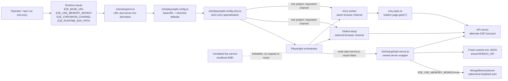
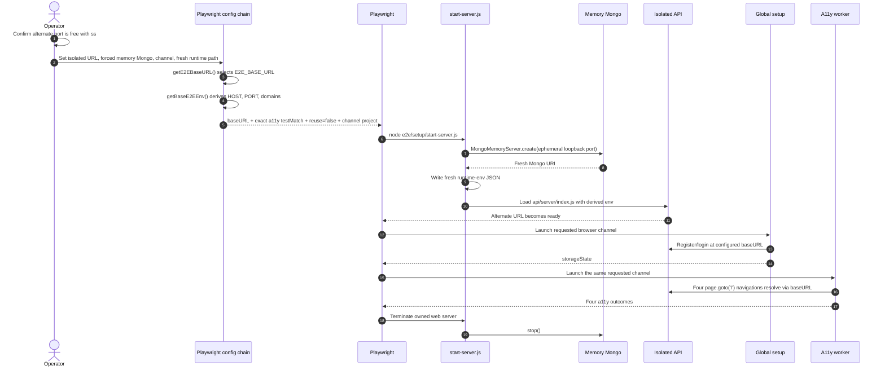

# AF-3rfc: Isolated a11y E2E System Map

## Purpose and Boundary

This map defines the contracts that make the accessibility Playwright suite an owned, isolated test runtime. The change is confined to `e2e/specs/a11y.spec.ts` and `e2e/playwright.config.a11y.ts`; production request handling, document mutation, authentication data, and cache invalidation are outside this flow.

The safety boundary is explicit: port 3080 has an unrelated live listener during this work. Validation uses a confirmed-free alternate port, and no browser, Playwright availability check, or HTTP client is addressed to port 3080.

## System Diagram



## Startup and Test Sequence



No sequence participant represents the live port-3080 service because it is not part of the allowed execution path.

## Runtime Data Flow

| Input | Transformation | Output | Consumer | Contract |
|---|---|---|---|---|
| `E2E_BASE_URL=http://127.0.0.1:<owned-port>` | `getE2EBaseURL()` and `getE2EServerAddress()` | `baseURL`, `HOST`, `PORT`, client/server domains | Playwright, server wrapper, global setup, workers | Every HTTP navigation and readiness check stays on the configured origin |
| `E2E_USE_MEMORY_MONGO=true` | `maybeStartMemoryMongo()` | Fresh loopback `MONGO_URI` with an ephemeral port | API server and runtime evidence | A reachable local/real Mongo is never reused during proof |
| `E2E_RUNTIME_ENV_PATH=<fresh-path>` | `writeRuntimeEnv()` | JSON containing the actual `MONGO_URI` | Validation evidence and teardown helpers | Evidence is fresh for this run and matches the startup log |
| `E2E_CHROMIUM_CHANNEL=chrome` | a11y `projects` override and `authenticate.ts` launch options | Project name/channel `chrome` | Global setup and test worker | Setup and workers launch the same available browser channel |
| `testMatch: 'a11y.spec.ts'` | Playwright filename glob under inherited `testDir` | Exactly one file/four tests | Test collection | Parent worktree names cannot broaden suite membership |
| `page.goto('/')` | Playwright URL resolution against `use.baseURL` | Configured alternate origin | Four a11y tests | No spec-level absolute URL can bypass isolation |
| `reuseExistingServer: false` | Playwright web-server ownership check | Start owned server or fail | Playwright orchestrator | An existing target is never silently adopted |

## Interface Grammar

```ebnf
loopback_host       = "127.0.0.1" ;
port                = digit, { digit } ;
owned_port          = port ;  (* checked free before startup; never 3080 *)
base_url            = "http://", loopback_host, ":", owned_port ;
memory_mongo_uri    = "mongodb://", loopback_host, ":", port, "/LibreChat-e2e" ;
browser_channel     = "chrome" | "chromium" | installed_channel_name ;
runtime_env         = "{", '"MONGO_URI"', ":", '"', memory_mongo_uri, '"', "}" ;
a11y_test_file      = "a11y.spec.ts" ;
relative_navigation = "/" ;

configured_run =
  "E2E_BASE_URL=", base_url,
  " E2E_USE_MEMORY_MONGO=true",
  " E2E_CHROMIUM_CHANNEL=", browser_channel,
  " E2E_RUNTIME_ENV_PATH=", fresh_file_path ;
```

Semantic constraints supplement the syntax:

- `owned_port != 3080` and is listener-free immediately before startup.
- The Mongo port is ephemeral and is neither 27017 nor 3080 for the forced-memory proof.
- `runtime_env.MONGO_URI` equals the URI logged by `start-server.js`.
- Collection contains exactly four tests from `a11y_test_file`.
- All four navigations are `relative_navigation` and resolve to `base_url`.

## Seam Contracts

| Seam | Producer | Consumer | Required contract | Fail-closed behavior |
|---|---|---|---|---|
| Environment -> base config | Shell | `env.ts` / `playwright.config.ts` | `E2E_BASE_URL` determines base URL, host, port, and domains | Invalid URL fails config evaluation; missing isolated input is not used in validation |
| Base config -> a11y specialization | `mainConfig` | `playwright.config.a11y.ts` | Preserve base URL/reporting/storage while overriding only a11y safety settings | Type/config validation fails rather than inventing fallback behavior |
| A11y config -> server lifecycle | `webServer` config | Playwright | Command is `start-server.js`, cwd is repo root, reuse is false | Occupied alternate target aborts; it is never reused |
| Wrapper -> database | `start-server.js` | `MongoMemoryServer` / API | Forced mode always creates disposable Mongo and injects its URI before API load | Mongo startup failure exits the server wrapper nonzero |
| Wrapper -> evidence | `writeRuntimeEnv()` | Validation | Fresh file contains the actual URI used by the API | Missing/mismatched file invalidates harness proof |
| Config -> browser setup | a11y project | `authenticate.ts` | Project channel and global-setup channel are derived from the same env value | Unavailable channel fails launch before test assertions |
| Config -> test worker | a11y project | Playwright worker | One channel-named Desktop Chrome project | Listing must show exactly one project and four tests |
| Base URL -> spec navigation | Playwright `use.baseURL` | `a11y.spec.ts` | Relative `/` is the only navigation origin input | Source gate rejects direct `localhost:3080` |
| Process teardown -> resources | Playwright / signals | `start-server.js` | Owned API and memory Mongo terminate after the run | Listener/process checks must be clean before closure |

## Invariants and Drift Detectors

1. The two implementation files contain neither `localhost:3080` nor direct `api/server/index.js` startup.
2. The a11y config selects `a11y.spec.ts` by filename, never by a regular expression that can match an ancestor directory.
3. The a11y config preserves every pre-existing `webServer.env` entry, especially `SESSION_EXPIRY=60000` and `REFRESH_TOKEN_EXPIRY=300000`.
4. `start-server.js` remains the only component that loads `api/server/index.js` in this flow.
5. Forced memory-Mongo evidence is a fresh loopback URI on an ephemeral port.
6. `E2E_CHROMIUM_CHANNEL` reaches both global setup and workers.
7. Validation performs only listener inspection against port 3080; it sends no HTTP or browser request there.

Drift is detected by the source gates, the four-test `[chrome]` `--list` result, the fresh runtime-env/log comparison, listener cleanup checks, and the exact isolated a11y run.

## Source Anchors

- URL fallback and parameterization: `e2e/setup/env.ts:4,37-50,100-125`
- Base Playwright URL/server inheritance: `e2e/playwright.config.ts:9-16,32-40,61-70`
- Current a11y override seams: `e2e/playwright.config.a11y.ts:1-16,51-59`
- Memory-Mongo provisioning and runtime evidence: `e2e/setup/start-server.js:120-159,211-225`
- Global-setup channel and URL consumption: `e2e/setup/authenticate.ts:8-10,43-55,72-90`
- Four stale absolute navigations to replace: `e2e/specs/a11y.spec.ts:4-42`

## Closure Boundary

This test-only flow performs no user-document mutation, so the repository's auth-user document cache invalidation rule is not activated. Successful closure requires both harness evidence (alternate base URL, owned server, disposable Mongo, aligned channel, exact test membership, no 3080 contact) and truthful reporting of the four a11y assertion outcomes.
