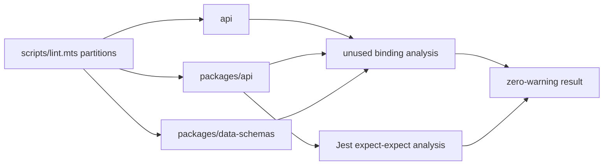
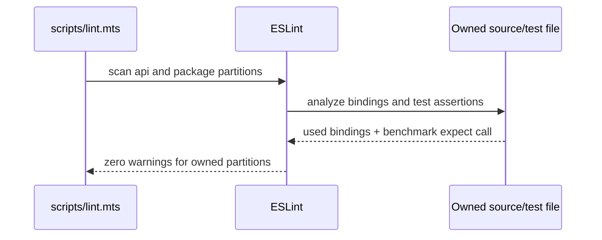

# AF-5qx7 Residual API and Package Warnings Plan

## Overview

Resolve the eight warning-only ESLint findings left in legacy API, package API, and data-schemas after the named error partitions were fixed. Each change is local and behavior-preserving; no rule severity or ignore changes are permitted.

## Current State Analysis

Node v24.16.0 root lint after commit `c4b7a945c` reports:

- `api`: four `no-unused-vars` warnings across two catch bindings and two mock callback parameters.
- `packages/api`: one unused benchmark local and one `jest/expect-expect` warning in the same manual Redis benchmark.
- `packages/data-schemas`: two unused imports.
- Only `client` exits nonzero, but repository instructions require warnings as well as errors to be resolved.

## Desired End State

- Scoped lint across `api`, `packages/api`, and `packages/data-schemas` passes with `--max-warnings 0`.
- Generic error response behavior and OpenID mock signatures remain unchanged.
- The Redis benchmark validates its populated fixture before timing without asserting performance thresholds.
- No unused imports or locals remain in the six files.

## What We're NOT Doing

- No client, e2e, config, data-provider, BAML, or root-source edits.
- No production behavior, response body, logging, lint-rule, or ignore changes.
- No execution of the manual Redis benchmark without its required live cluster.

## Implementation Approach

Use the narrowest semantic edit for each warning: optional catch bindings for deliberately ignored errors, underscore-prefixed names for load-bearing mock signature parameters, remove truly unused imports/locals, and add a fixture-integrity assertion to the assertion-free benchmark.

### Locked Decisions

- Error objects remain intentionally unobserved; no logging or response changes are added under a lint-cleanup bead.
- Strategy mock callback arity stays two; underscore prefixes document intentionally unused contract parameters.
- The benchmark assertion covers fixture cardinality only. Latency remains reported, never pass/fail gated.
- The live Redis benchmark remains manual and is not claimed green without its required cluster.
- No diagnostic is resolved through a rule change, ignore, or inline disable.

## Phase 1: Resolve Legacy API Bindings

### Red

Given the current API files, scoped ESLint reports four unused bindings.

### Green

- `api/server/middleware/roles/admin.js`: replace `catch (error)` with optional `catch` while preserving the generic 500 response.
- `api/server/routes/search.js`: replace `catch (error)` with optional `catch` while preserving `res.send(false)`.
- `api/test/__mocks__/openid-client.js`: rename `options` and `verify` to `_options` and `_verify`, retaining the mocked Strategy callback arity and intent.

### Refactor

Keep response and return statements byte-for-byte unchanged; run API lint with zero-warning enforcement.

## Phase 2: Make the Manual Benchmark Self-Validating

### Red

Given the raw-MGET manual benchmark, ESLint reports an unused `cache` local and a test with no assertion.

### Green

- Await `populateCache(ns, configCount)` for its required seeding side effect without retaining the return value.
- After SCAN discovers keys and before timing retrieval, assert `keys` has length `configCount`.

### Refactor

Do not assert timing values or change benchmark concurrency, cleanup, Redis calls, or manual-only status.

## Phase 3: Remove Unused Imports

### Red

Given the current data-schemas files, scoped ESLint reports `RerankerTypes` and `SYSTEM_TENANT_ID` as unused.

### Green

- Remove `RerankerTypes` from `packages/data-schemas/src/app/web.ts`.
- Remove `SYSTEM_TENANT_ID` from `packages/data-schemas/src/utils/tenantBulkWrite.spec.ts`.

### Refactor

Run the import-order checker after the import edits.

## Success Criteria

### Automated Verification

- [x] Red baseline: the three scoped partitions report exactly eight warnings.
- [x] Zero-warning lint: `node node_modules/eslint/bin/eslint.js --max-warnings 0 --ext .js,.jsx,.ts,.tsx --ignore-pattern '**/*.cjs' --ignore-pattern '**/*.mjs' api packages/api packages/data-schemas`.
- [x] Formatting: `npx prettier --check` on the six touched files.
- [x] Import ordering: `npm run sort-imports:check` reports all 3309 files sorted.
- [x] Diff hygiene: `git diff --check`.
- [x] Root `npm run lint` emits none of these eight warnings; final client status is coordinated with its owners.

### Manual Verification

- [x] Diff review confirms only unused syntax and the benchmark fixture assertion changed.

## Testing Strategy

The lint command is the Red/Green behavior check for this cleanup. The new benchmark assertion verifies data preparation when the manual benchmark is run with Redis. Production handlers retain the exact same branches and responses, so no new runtime test is required for optional catch binding syntax.

## System Map

### Sequence

### Boundary Grammar and Contracts

| Seam | Grammar | Contract |
|---|---|---|
| API catch handler | `catch { GenericFailureResponse }` | Failure values remain intentionally opaque; response behavior is unchanged. |
| Strategy mock | `StrategyCallback ::= (_options, _verify) => MockStrategy` | Callback accepts constructor inputs but intentionally ignores them. |
| Benchmark fixture | `Fixture ::= populateCache(count) -> scan(keys) -> expect(length = count)` | Timing starts only after the configured key count is observable. |
| Import cleanup | `Import ::= UsedBinding*` | Removing an unused binding does not alter module evaluation or exports. |

This is a synchronous lint/test hygiene path, not a production source-to-side-effect-to-read workflow; no closure test applies.

## References

- Bead: `AF-5qx7`
- Research: `thoughts/searchable/shared/research/2026-08-16-12-37-AF-5qx7-api-package-warnings.md`
- Review: `thoughts/searchable/shared/plans/2026-08-16-AF-5qx7-api-package-warnings-REVIEW.md`

## Review Amendments Applied

- The review found no contract or hygiene defects.
- Its required locked decisions are recorded above, preserving generic error behavior, callback arity, manual benchmark status, and assertion scope.
