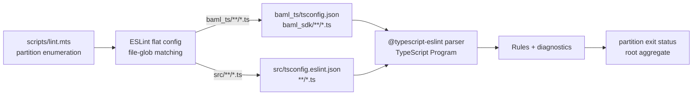
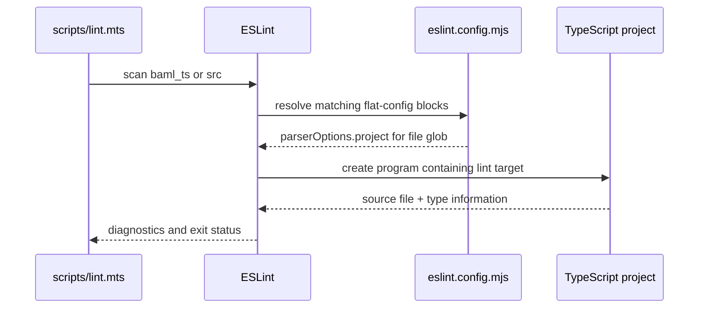

# AF-5qx7 BAML and Root `src` ESLint Project Coverage Plan

## Overview

Route the `baml_ts` and root `src` lint partitions to TypeScript projects that actually include their files. This removes 36 parser-project errors without disabling rules, ignoring files, or changing runtime behavior.

## Current State Analysis

- `scripts/lint.mts:11-22` deliberately scans `baml_ts` and `src`.
- `eslint.config.mjs:221-270` applies `client/tsconfig.json` to both partitions because its exclusions name only packages, client Vite config, and e2e.
- `baml_ts/tsconfig.json:1-14` already includes all generated SDK TypeScript files.
- `src/tests/oidc-integration.test.ts` is not included by any existing TS project; it imports package API test targets.
- Node v24.16.0 baseline command:

  ```bash
  node node_modules/eslint/bin/eslint.js --ext .js,.jsx,.ts,.tsx \
    --ignore-pattern '**/*.cjs' --ignore-pattern '**/*.mjs' baml_ts src
  ```

  Current result: 36 errors, zero warnings; 35 BAML and one root `src`, all parser-project file-not-found diagnostics.

## Desired End State

- Every `baml_ts/baml_sdk/**/*.ts` file is parsed through `baml_ts/tsconfig.json`.
- Every root `src/**/*.ts` file is parsed through a checked-in `src/tsconfig.eslint.json` that includes the partition and inherits the package API test compiler environment used by the OIDC integration test.
- The exact two-partition lint command exits zero errors.
- `npm run build:baml` still passes.
- `npx tsc -p src/tsconfig.eslint.json --showConfig` proves the root test is a member of the lint project.
- The repository-wide `npm run lint` no longer lists `baml_ts` or `src` among failed partitions; other agents own the remaining partitions.

### Key Discoveries

- The BAML project exists and is complete; only ESLint project selection is wrong (`baml_ts/tsconfig.json:13`, `eslint.config.mjs:236`).
- The root test's nearest semantic owner is the package API test environment because it directly imports `packages/api/src/utils/oidc` and `packages/api/src/utils/env` (`src/tests/oidc-integration.test.ts:1-12`).
- Existing flat-config structure uses later, narrower project overrides for non-client TypeScript partitions (`eslint.config.mjs:272-371`).

## What We're NOT Doing

- No hand edits to generated BAML SDK or OIDC test source; newly exposed fixable findings use ESLint's deterministic autofixer.
- No production API source edits.
- No ESLint rule suppression, broad ignore, or rule-severity change.
- No change to package API build/test inclusion.
- No work in the client, e2e, config, or data-provider lint partitions owned by other agents.

## Implementation Approach

Add one TypeScript project for the root `src` partition and two narrow flat-config project mappings. Keep both mappings after the broad client typed block so they replace only `parserOptions.project` for their own files while retaining the repository's existing TypeScript lint rules.

### Locked Decisions

- Flat-config glob and TS-project include scopes remain identical: `src/**/*.ts` maps to a lint-only root project whose include is `**/*.ts` relative to `src`.
- The root project inherits `packages/api/tsconfig.spec.json`; it does not broaden that package's own include list.
- The root project is named `tsconfig.eslint.json` because the historical test's module graph is not a standalone build target; membership and ESLint parsing, not a new root compilation contract, are in scope.
- BAML uses its existing build project; generated source is never moved or added to the client project.
- This slice changes project selection only. Rules, severities, ignores, source, and runtime behavior remain unchanged.

## Phase 1: Restore TypeScript Project Ownership

### Red — Reproduce the project mismatch

Given the existing flat config, when ESLint scans `baml_ts` and `src`, then it reports 36 `parserOptions.project` file-not-found errors. Preserve the recorded baseline as the failing test; no new unit test is warranted for declarative lint configuration.

### Green — Add the minimum project mappings

#### 1. Root `src` TypeScript project

**File**: `src/tsconfig.eslint.json`  
**Changes**:

- Extend `../packages/api/tsconfig.spec.json` so the OIDC integration test uses the package API test compiler environment.
- Include `**/*.ts` relative to root `src`, matching the complete ESLint `src/**/*.ts` scope.
- Keep `noEmit: true` explicit and name the file as an ESLint-only ownership project.

#### 2. ESLint project selection

**File**: `eslint.config.mjs`  
**Changes**:

- Add a `baml_ts/**/*.ts` override selecting `./baml_ts/tsconfig.json`.
- Add a `src/**/*.ts` override selecting `./src/tsconfig.eslint.json`.
- Change no rules and add no ignores.

### Refactor — Verify the narrowest shape

- Confirm the new blocks set only `languageOptions.parserOptions.project` and do not duplicate existing rules.
- Keep the blocks adjacent to the other project-specific TypeScript overrides.
- Run Prettier checks on both config files.

## Phase 2: Autofix Findings Revealed by Correct Parsing

### Red — Observe non-parser findings

After the project mappings take effect, the same partition command exposes one unused generated ESLint directive in BAML and 19 Prettier findings in the historical root OIDC test.

### Green — Run the repository autofixer on the owned partitions

- Run ESLint `--fix` against only `baml_ts` and `src`; do not hand-edit the generated SDK or the test formatting.
- Review the resulting diff to confirm it removes the unused directive and applies formatting only.

### Refactor — Keep mechanical edits isolated

- Do not mix the auto-fixed source changes with any client, config, e2e, or data-provider work.
- Re-run the import-order checker to ensure formatting did not disturb the normalized baseline.

### Success Criteria

#### Automated Verification

- [x] Red baseline observed: exact two-partition ESLint command reports 36 parser errors.
- [x] Root project membership is explicit: `npx tsc -p src/tsconfig.eslint.json --showConfig` lists `./tests/oidc-integration.test.ts`.
- [x] BAML project is valid: `npm run build:baml`.
- [x] Target lint is green: `node node_modules/eslint/bin/eslint.js --ext .js,.jsx,.ts,.tsx --ignore-pattern '**/*.cjs' --ignore-pattern '**/*.mjs' baml_ts src`.
- [x] Formatting is green: `npx prettier --check eslint.config.mjs src/tsconfig.eslint.json`.
- [x] Import-order baseline remains green: `npm run sort-imports:check`.
- [ ] Repository lint no longer fails `baml_ts` or `src`: `npm run lint` (final repository result coordinated with the other partitions).

#### Manual Verification

- [x] Review confirms the diff changes project configuration plus deterministic autofixes only; it changes no lint rules, ignores, test behavior, or runtime code.

## Testing Strategy

The failing lint invocation is the behavior-level Red test. TypeScript compiler invocations verify that both selected projects genuinely own and can parse their files. The same partition lint command supplies Green. The root lint driver supplies integration coverage across flat-config ordering and all concurrent partition fixes.

### Smallest Testable Behaviors

1. Given a generated BAML TypeScript file, when ESLint resolves its parser project, then the file belongs to `baml_ts/tsconfig.json` and produces no project-not-found error.
2. Given `src/tests/oidc-integration.test.ts`, when ESLint resolves its parser project, then the file belongs to `src/tsconfig.eslint.json` and produces no project-not-found error.
3. Given correct parsing exposes ordinary fixable findings, when the repository autofixer runs on the two owned partitions, then the target lint reports zero errors and zero warnings.
4. Given both partition mappings, when the root lint driver scans the repository, then neither `baml_ts` nor `src` is listed as a failed partition.

## Performance Considerations

Both overrides reuse existing project-sized programs. The lint-only root project contains one test file; it does not broaden the client project, create a new build target, or add generated BAML files to another workspace program.

## System Map



### Sequence



### Boundary Contracts

| Seam | Input grammar | Contract | Observable failure |
|---|---|---|---|
| Lint driver → ESLint | `Partition ::= "baml_ts" | "src"` | Every declared source partition contains at least one lintable file and is invoked with TS enabled. | Partition is added to `failedPartitions`. |
| Flat config → BAML project | `BamlFile ::= "baml_ts/" BamlSdkPath ".ts"` | Matching files select `./baml_ts/tsconfig.json`; that project includes `baml_sdk/**/*.ts`. | `parserOptions.project` file-not-found diagnostic. |
| Flat config → root project | `RootFile ::= "src/" RelativePath ".ts"` | Matching files select `./src/tsconfig.eslint.json`; that project includes `**/*.ts`. | `parserOptions.project` file-not-found diagnostic. |
| Parser → lint driver | `Result ::= Diagnostics* ExitStatus` | Zero error diagnostics yields a successful partition; warnings retain existing repository policy. | Nonzero exit and partition named in root summary. |

The project-selection seams carry file paths and compiler configuration only. They carry no user identity, tenant context, request state, persisted data, or runtime side effect.

## Migration Notes

None. This is developer-tool configuration with no persisted data, public interface, or runtime behavior change.

## References

- Bead: `AF-5qx7`
- Research: `thoughts/searchable/shared/research/2026-08-16-12-22-AF-5qx7-baml-root-eslint-project-coverage.md`
- Lint driver: `scripts/lint.mts:11-22,61-102`
- Flat config: `eslint.config.mjs:212-371`
- BAML project: `baml_ts/tsconfig.json:1-14`
- Root integration test: `src/tests/oidc-integration.test.ts:1-12`
- Plan review: `thoughts/searchable/shared/plans/2026-08-16-AF-5qx7-baml-root-eslint-project-coverage-REVIEW.md`

## Review Amendments Applied

- Contract warning resolved: `src/tsconfig.eslint.json` now plans `**/*.ts`, matching the full `src/**/*.ts` ESLint mapping rather than only the currently populated `tests` directory.
- Verification warning resolved: the automated matrix now inspects the resolved TS program with `--showConfig` before relying on the compiler and lint results.
- Implementation discovery incorporated: the root project is explicitly lint-only, and the ordinary BAML/root findings exposed after parser recovery are fixed through the repository autofixer as a separate Red-Green-Refactor phase.
