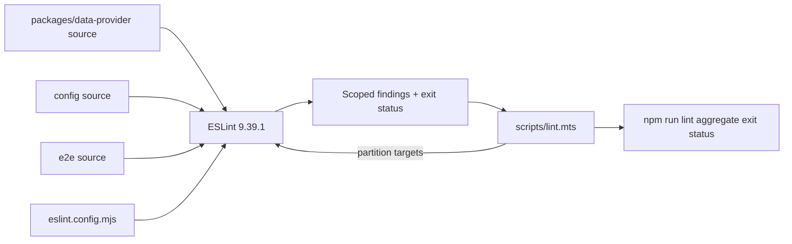
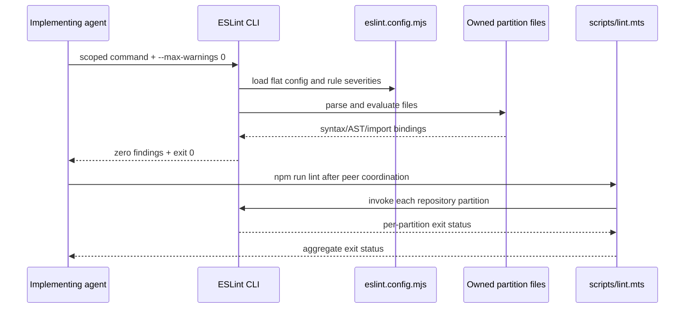

# AF-5qx7 Config, E2E, and Data-Provider ESLint Cleanup Plan

## Overview

Resolve the 8 errors and 3 warnings owned by WindyGorge in the
`packages/data-provider`, `config`, and `e2e` lint partitions. Use the existing
ESLint failures as the red tests, make only behavior-preserving local changes, and
verify each partition independently before participating in the coordinated root gate.

## Current State Analysis

The root driver in `scripts/lint.mts` scans all configured partitions and reports every
nonzero result. Exact scoped runs at research commit
`90bf5dd54a090f9a1c420f660eb6741de11e21a3` reproduce:

- `packages/data-provider`: 1 `no-nested-ternary` error at
  `packages/data-provider/src/config.ts:2190`.
- `config`: 3 Prettier errors and 3 unused-binding warnings across four files.
- `e2e`: 4 TypeScript unused-variable errors across two specs.

Detailed evidence is in
`thoughts/searchable/shared/research/2026-08-16-12-23-AF-5qx7-config-e2e-data-provider-eslint.md`.

## Desired End State

The three direct partition commands exit 0 with no findings, existing BAML config tests
remain green, and the eventual coordinated `npm run lint` exits 0 after the other agents'
client and parser-project partitions land.

### Key Discoveries

- The data-provider nested ternary selects one of two issue builders or an empty array;
  explicit `if`/`else if` assignment preserves those three outcomes.
- All config formatting errors are autofixable by the configured Prettier rule.
- The remaining findings are unused imports, parameters, catch bindings, or a dead read;
  none owns a runtime side effect.
- E2E files receive non-typechecked TypeScript recommended rules even though they are
  excluded from the typed client-project block.

## What We're Not Doing

- No rule disables, broad ignores, severity changes, or ESLint configuration edits.
- No changes to the client, BAML, root `src`, API, or data-schemas partitions.
- No product behavior, API contract, data model, or user-document mutation.
- No attempt to make the old `settings.spec.ts` test assert additional behavior beyond its
  present UI assertion.

## Implementation Approach

Treat each lint partition as an independent red-green-refactor slice. Capture the current
failure, apply the smallest source cleanup, rerun only that partition, and commit the
partition separately. Keep the root lint gate until all Agent Mail owners report their
partitions ready.

## Phase 1: Data-Provider Conditional Cleanup

### Red

- [ ] Confirm `packages/data-provider/src/config.ts:2190` fails
  `no-nested-ternary` and no other data-provider finding exists.

### Green

**File**: `packages/data-provider/src/config.ts`

- [ ] Initialize `issues` to an explicitly typed empty `BamlIssue[]`.
- [ ] Assign BAML issues in an `if` branch and Claude Agent SDK issues in an `else if`
  branch, preserving the empty default for other endpoints.
- [ ] Leave issue emission and both builder functions unchanged.

### Refactor and Verify

- [ ] Direct data-provider ESLint passes with `--max-warnings 0`.
- [ ] Existing BAML config schema tests pass.
- [ ] Data-provider build passes if the shared workspace remains stable for the build.

## Phase 2: Config Formatting and Binding Cleanup

### Red

- [ ] Confirm 3 errors and 3 warnings in the config partition.

### Green

**Files**:

- `config/create-user.js` — run
  `node_modules/.bin/prettier --write config/create-user.js` for the three reported
  formatting errors only.
- `config/helpers.js` and `config/update.js` — use bindingless catches where the exception is
  intentionally ignored.
- `config/translations/instructions.ts` — remove the unused `fileName` parameter and its call
  argument.

### Refactor and Verify

- [ ] Direct config ESLint passes with `--max-warnings 0`.
- [ ] Review the diff to confirm no executable expression changed beyond unused bindings.

## Phase 3: E2E Dead-Binding Cleanup

### Red

- [ ] Confirm 4 errors in the e2e partition.

### Green

**Files**:

- `e2e/specs/mock/shared-links.spec.ts` — remove unused `MOCK_REPLY_TEXT` from the existing
  helper import.
- `e2e/specs/settings.spec.ts` — use bindingless catches and remove the unused local-storage
  read while preserving all user actions and the existing Sydney-button assertion.

### Refactor and Verify

- [ ] Direct e2e ESLint passes with `--max-warnings 0`.
- [ ] Review the diff to confirm test actions and assertions are unchanged.

## Testing Strategy

### Automated Verification

```bash
node node_modules/eslint/bin/eslint.js --ext .js,.jsx,.ts,.tsx \
  --ignore-pattern '**/*.cjs' --ignore-pattern '**/*.mjs' --max-warnings 0 \
  packages/data-provider
node node_modules/eslint/bin/eslint.js --ext .js,.jsx,.ts,.tsx \
  --ignore-pattern '**/*.cjs' --ignore-pattern '**/*.mjs' --max-warnings 0 config
node node_modules/eslint/bin/eslint.js --ext .js,.jsx,.ts,.tsx \
  --ignore-pattern '**/*.cjs' --ignore-pattern '**/*.mjs' --max-warnings 0 e2e
cd packages/data-provider && ../../node_modules/.bin/jest specs/baml-config.spec.ts \
  --runInBand --coverage=false
cd ../.. && npm run build:data-provider
npm run lint
```

The final two commands are coordinated gates: run them after other agents finish touching
shared lint configuration and partitions.

### Manual Verification

- [ ] Inspect every source diff for expression-order or assertion changes.
- [ ] Confirm staging contains only the announced partition plus this agent's workflow
  artifacts.

## Workflow Closure

**Classification: LEAF.** The promised behavior is a static-analysis result: source files
are read directly by ESLint and the partition command returns success or failure. There is no
queue, background worker, separate registration boundary, projection, cache, or downstream
read model between the edited source and the observable exit status. The scoped lint command
is therefore the closure test; no adapter, async driver, or production registration seam is
required.

## System Map

### Static-Analysis Data Flow



### Verification Sequence



### Interface Grammar and Seam Contracts

```ebnf
Partition       = Label, TargetPath, { TargetPath } ;
Finding         = FilePath, Line, Column, Severity, RuleId, Message ;
ScopedCommand   = ESLintExecutable, Extensions, IgnorePatterns,
                  "--max-warnings", "0", TargetPath ;
ScopedGreen     = ExitCodeZero, FindingCountZero ;
RepositoryGreen = EveryPartitionInvoked, EveryPartitionExitCodeZero ;
```

| Seam | Input contract | Output contract | Failure contract |
|---|---|---|---|
| Agent → ESLint | Pinned executable, repository root cwd, one owned target, existing flat config | Diagnostics for that target | Nonzero on any error or warning because `--max-warnings 0` is set |
| ESLint config → rules | File globs and ordered flat-config blocks | Effective parser and severities | Parser/rule diagnostics identify file, position, and rule |
| Driver → ESLint | Every partition from `SOURCE_DIRECTORIES` | One exit status per partition | Driver continues after a failure and records the partition label |
| Driver → caller | Complete per-partition results | Exit 0 only when all partitions pass | Final message lists every failed partition and process exit is nonzero |

There is no user-document, network, persistence, queue, or authentication seam in this
slice. The only mutable artifact crossing these boundaries is source text in the working
tree; no auth-user cache invalidation is applicable.

## Review Amendment Traceability

- Review contract amendment: all scoped lint commands now enforce zero warnings with
  `--max-warnings 0`.
- Review CodeCleanup amendment: the config formatting step now names the exact pinned
  Prettier command.
- No critical review issues were reported; no scope or behavior amendment was required.

## Performance and Migration Considerations

There is no runtime performance or migration impact. The data-provider selector remains a
single ordered discriminator check, and the other edits remove unused syntax or apply
formatting.

## References

- Beads issue: `AF-5qx7`
- Research:
  `thoughts/searchable/shared/research/2026-08-16-12-23-AF-5qx7-config-e2e-data-provider-eslint.md`
- Lint driver: `scripts/lint.mts`
- Rules: `eslint.config.mjs`
